# Documento de análisis de requisitos del sistema

## Introducción

Este proyecto pretende ofrecer la posibilidad de jugar de forma online al juego de mesa Skull King, juego de cartas con temática pirata en el cual deberás apostar el número exacto de bazas que crees que ganarás en cada ronda. El programa permite a la persona interesada crear un usuario con el que será capaz de contactar con otros jugadores e iniciar una partida. 

Esta adaptación tiene como límite 10 jugadores en partida. Además, no se podrá comenzar una partida a menos que haya 3 usuarios en esta.

### EXPLICACIÓN DEL JUEGO:

En el comienzo de la partida se realiza el primer reparto de cartas. El número de cartas vendrá determinado por la ronda en la que se encuentre la partida, por ejemplo: ronda 3, se reparten 3 cartas, una por cada baza. Existe una excepción en las partidas de más de 8 jugadores, pues en alguna ronda no se podrá aplicar la regla anterior ya que no hay suficientes cartas. Por ello, se repartirá el máximo de cartas posibles a cada jugador, siendo estas la misma cantidad.

Cada jugador jugará su carta, y siguiendo la jerarquía se determinará el ganador de cada baza. Una vez jugadas las bazas que forman la ronda, se realizará el cálculo de puntos, incluyendo los puntos de bonificación.

Finalmente, el ganador se definirá a partir de la suma de las puntuaciones de las 10 rondas que conforman la partida, la cual tiene una duración media de 30 minutos. 

### JERARQUÍA DE CARTAS:

En la cúspide de la jerarquía se encuentran las cartas de personaje: pirata, sirena y Skull King. Estos mantienen una relación parecida al juego “piedra, papel y tijera”; el pirata gana a la sirena, el Skull King al pirata y la sirena al Skull King. Además, debemos tener en cuenta la carta tigresa, pues puede ejercer dos papeles, pirata o bandera blanca. 

Siguiendo la jerarquía, hallamos el palo de triunfos con cartas numeradas del 1 al 14. Por debajo, se sitúan el resto de palos, morado, amarillo y verde, numerados de la misma forma. Finalmente, se encuentran las banderas blancas, las cuales pierden la baza independientemente del resto de cartas jugadas.

### CARTAS:

#### Bandera Blanca

 Las 5 cartas de bandera blanca pueden ser jugadas para ‘no ganar’ al considerarse de valor 0. Pierden con el resto de cartas. Son muy útiles para aseguraros no ganar más bazas de las que se han pujado.

#### Pirata

Las cartas de Pirata superan a todas las cartas numeradas. Todas son de igual valor, por lo que si se juegan más de una en la misma baza, quien haya jugado el primer pirata ganará la baza.

#### Tigresa

Al jugar la Tigresa, debéis declarar si contará como Pirata o como Huida. Asume todas la características de un pirata o de una huida.

#### Skull King

El Skull King vence a todas las cartas numeradas y todos los Piratas (incluida la Tigresa al ser jugada como Pirata). Las únicas que puede derrotarle son las Sirenas.

#### Sirena

Las Sirenas vencen a todos los palos numerados pero pierden con todos los Piratas,con la excepción del Skull King. Si se juegan ambas Sirenas en la misma baza, la primera que fue jugada ganará la baza.

#### Palos normales (amarillo, verde y morado)

Hay tres palos normales: amarillo (Cofre del Tesoro), verde (Loro) y morado (Mapa del Tesoro).

#### Palo Triunfo

Las cartas triunfo son superiores a la de las otras tres palos.

### PUNTUACIÓN:

A la hora de apostar se decide cómo se ganarán puntos. Por un lado, se puede apostar todo a perder, el jugador deberá perder todas las bazas. En el caso de acertar su apuesta se multiplicará por 10 el número de cartas de la ronda, y si se equivoca, se multiplicará por -10 el número anterior. Por otro lado, se puede realizar una apuesta normal en la cual las bazas ganadas se multiplicarán por 20 si se acierta la apuesta, en caso de que esta sea errónea, se multiplicará por -10 aquellas bazas no acertadas.

Una vez realizado dicho cálculo de puntos se sumarán los puntos de bonificación si y sólo si se ha acertado la apuesta. Para ello, se deberá analizar las bazas ganadas de cada jugador. 

Si se halla alguna carta 14 de los palos normales, se deberá sumar 10 puntos por cada una, y en el caso de encontrar el 14 del palo de triunfos, se sumarán 20 puntos. Para calcular los puntos que se obtienen con las cartas de personaje se deberá tener en cuenta las relaciones: 20 puntos por cada sirena ganada por el pirata, 30 puntos por cada pirata ganado por el Skull King, y 40 puntos si la sirena ha ganado al Skull King.

[Enlace al vídeo de explicación de las reglas del juego / partida jugada por el grupo](https://youtu.be/CV1VBWZAIJM)

## Tipos de Usuarios / Roles

Jugador: Usuario interesado en jugar al juego de mesa SkullKing desde su dispositivo

Administrador: Persona autorizada a intervenir entre los usuarios y a acceder a la información registrada en la aplicación de las partidas en curso y las finalizadas y de los usuarios registrados.

## Historias de Usuario

A continuación se definen todas las historias de usuario a implementar:

### HGJ1-(ISSUE#49): Registrar usuarios ([https://github.com/gii-is-DP1/DP1-2024-2025--l7-5/issues/49]())
| "Como jugador o administrador quiero poder registrarme en el juego para poder jugar al mismo o gestionarlo."| 
|-----|
||
||
|Puedes presionar el botón "Jugador" para registrarte como jugador, esto te enviará a un formulario en el cuál simplemente debes introducir los datos indicados y presionar "Guardar" para registrar tu perfil. Lo mismo ocurre con el botón "Administrador", y por tanto, te registrarás como administrador.|
|Caso negativo: Si el usuario ya existe, se mostrará un error en el que se indicará que el usuario está ocupado.|

### HGJ2-(ISSUE#50): Iniciar sesión ([https://github.com/gii-is-DP1/DP1-2024-2025--l7-5/issues/50]())
| "Como jugador o administrador quiero poder iniciar sesión en el juego para jugar desde mi usuario."| 
|-----|
|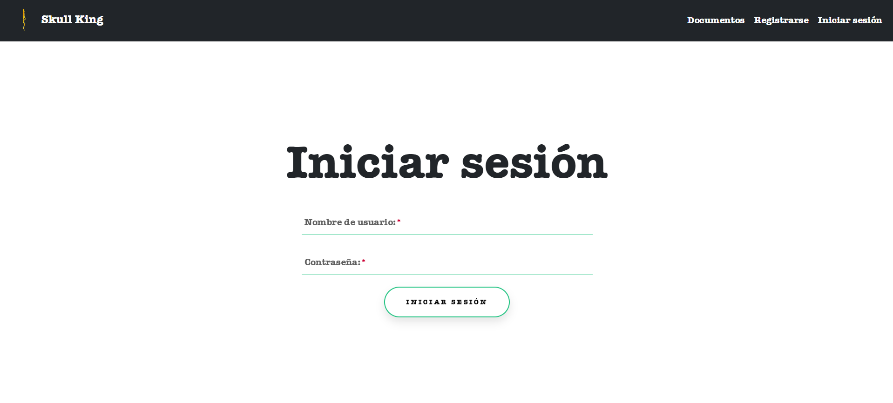|
|Tienes que rellenar los datos solicitados para verificar que efectivamente es tu usuario, finalmente puedes presionar "Iniciar sesión", en el cual si los datos son correctos entrarás en tu perfil redirigiendote a la página principal.|
|Caso negativo: Si el usuario o la contraseña son incorrectos, se mostrará un error en el que se indicará que los datos de inicio de sesión son incorrectos, pudiendo introducirlos nuevamente.|

### HGJ3-(ISSUE#51): Cerrar sesión ([https://github.com/gii-is-DP1/DP1-2024-2025--l7-5/issues/51]())
| "Como jugador o administrador quiero poder cerrar sesión para salirme de mi usuario y evitar que otras personas lo usen."| 
|-----|
|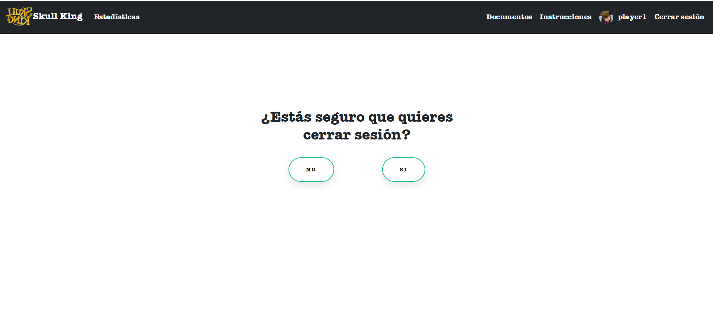|
|Siempre y cuando tengas la sesión abierta, aparecerá en la barra de navegación el botón "Cerrar sesión", una vez presionado te redirigirá a una pantalla de cierre de sesión en la que confirmará la selección y ya no estarás con la sesión abierta en tu perfil.|

### HGJ4-(ISSUE#203): Ver perfil de usuario ([https://github.com/gii-is-DP1/DP1-2024-2025--l7-5/issues/203]())
| "Como jugador quiero poder ver mi perfil para saber la información que muestro en el juego."| 
|-----|
|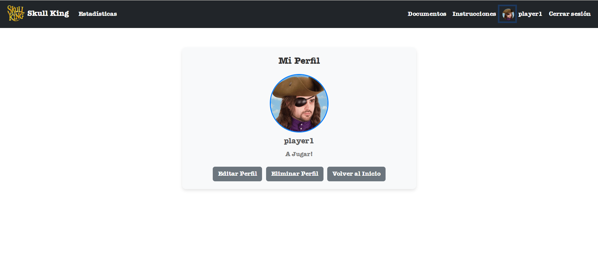|
| Siempre que se encuentre con la sesión abierta podrá ver su propio perfil y tendrá la opción de editar o eliminar su cuenta.|
|Caso negativo: Si el usuario ya se encuentra en una sala de espera para jugar o en una partida en curso el sistema no le permitirá eliminar ni modificar su perfil hasta que termine la partida. En cambio le aparecerá un botón para volver a la partida.|
|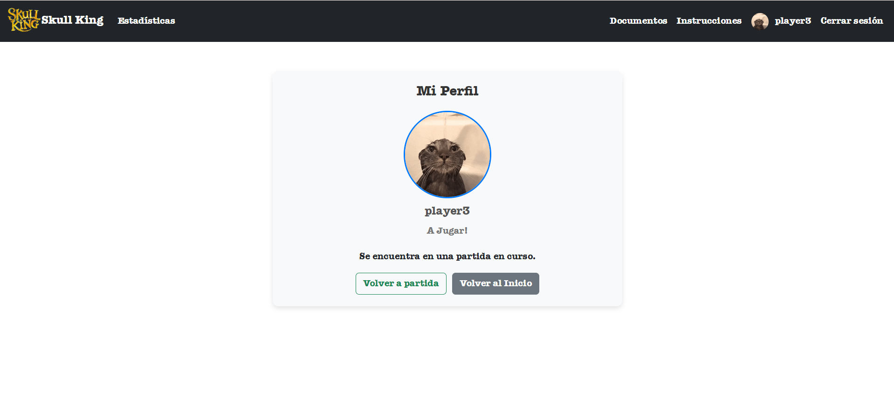|

### HGJ5-(ISSUE#52): Editar perfil de usuario ([https://github.com/gii-is-DP1/DP1-2024-2025--l7-5/issues/52]())
| "Como jugador quiero poder editar mi perfil para modificar mi información a mi elección."| 
|-----|
||
|Al presionar el botón "Editar Perfil" en la visualización de su perfil se muestra un formulario en el cuál se puede modificar sus datos personales .|

### HGJ6-(ISSUE#204): Eliminar perfil de usuario ([https://github.com/gii-is-DP1/DP1-2024-2025--l7-5/issues/204]())
| "Como jugador quiero poder eliminar mi propia cuenta."| 
|-----|
|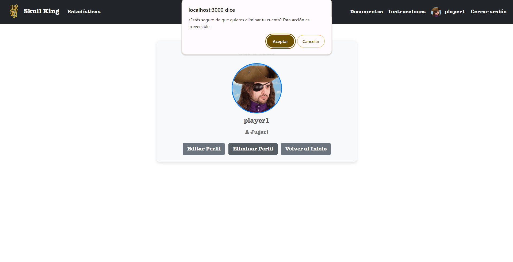|
|Al presionar el botón "Eliminar Perfil" en la visualización de su perfil se mostrará una advertencia en la cuál te advierte de la acción y debes Aceptar o Cancelar según quieras eliminar tu cuenta o no finalmente.|

### HGA1-(ISSUE#30): Listado usuarios registrados ([https://github.com/gii-is-DP1/DP1-2024-2025--l7-5/issues/30]())
| "Como administrador quiero ver el listado de usuarios registrados para llevar un control sobre la cantidad de usuarios en el sistema."| 
|-----|
||
|Se despliega una lista de todos los usuarios registrados en el sistema ordenados por su autoridad y por nombre paginados en seis usuarios por página.|

### HGA2-(ISSUE#197): Borrar un usuario ([https://github.com/gii-is-DP1/DP1-2024-2025--l7-5/issues/197]())
| "Como administrador quiero poder borrar usuarios para llevar un control adecuado de los usuarios del sistema."|
|-----|
|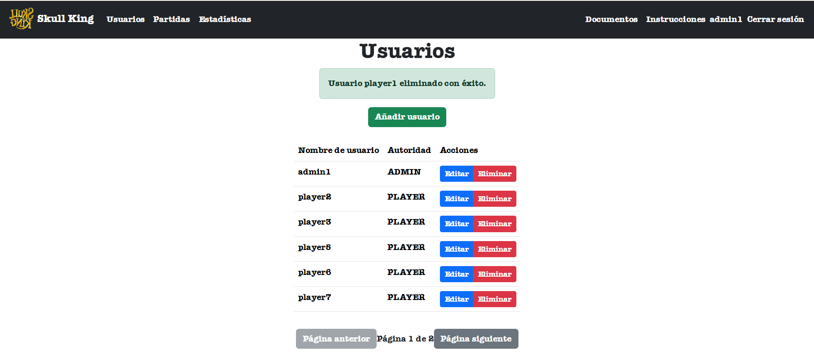|
|Al presionar el botón "Borrar" en la visualización de los usuarios se mostrará una alerta la cuál te muestra que se ha eliminado el usuario, las partidas de las que era dueño y sus jugadores correctamente.|
|Caso negativo: Si el usuario a eliminar se encuentra en una partida en curso o en esperando no será posible eliminarlo y se mostrará en cada caso una alerta con su respectivo error.|
|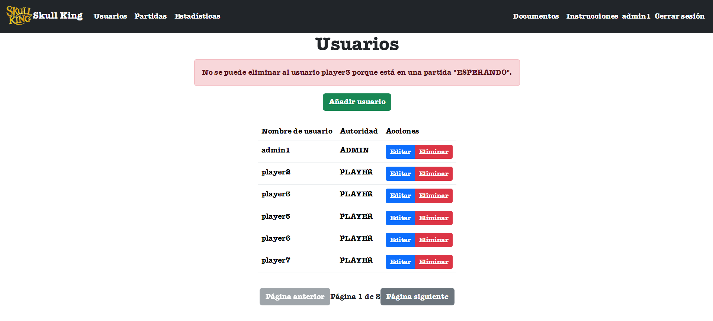|

### HGA3-(ISSUE#54): Editar un usuario ([https://github.com/gii-is-DP1/DP1-2024-2025--l7-5/issues/54]())
| "Como administrador quiero poder editar el perfil de cualquier usuario registrado en el sistema."|
|-----|
||
|Al presionar el botón "Editar" en la visualización de los usuarios se mostrará un formulario en el que se podrá modificar los datos del usuario especifico.|
|Caso negativo: Si el usuario a editar se encuentra en una partida en curso o en esperando no será posible editarlo y se mostrará en cada caso una alerta con su respectivo error.|
|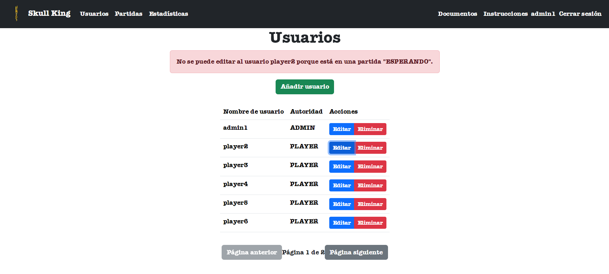|

### HGA4-(ISSUE#53): Crear un usuario ([https://github.com/gii-is-DP1/DP1-2024-2025--l7-5/issues/53]())
| "Como administrador quiero poder crear un usuario para llevar una administración del sistema"|
|-----|
|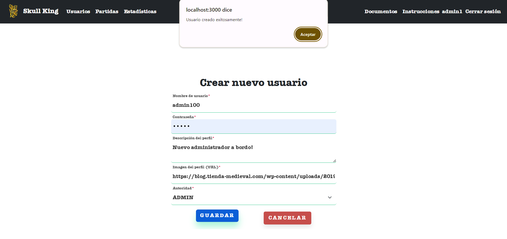|
|Pulsando el botón "Añadir usuario" en la visualización de usuarios, el administrador podrá ver un formulario para rellenar los datos correspondientes al nuevo usuario y confirmar la creación.|

### HJA1-(ISSUE#44): Ver listado de partidas ordenadas y por filtros ([https://github.com/gii-is-DP1/DP1-2024-2025--l7-5/issues/44]())
| "Como administrador quiero poder ver el listado de partidas, incluyendo nombre de la partida, estado, jugadores participantes, jugador creador y la fecha de creación para llevar un control sobre las partidas creadas."| 
|-----|
|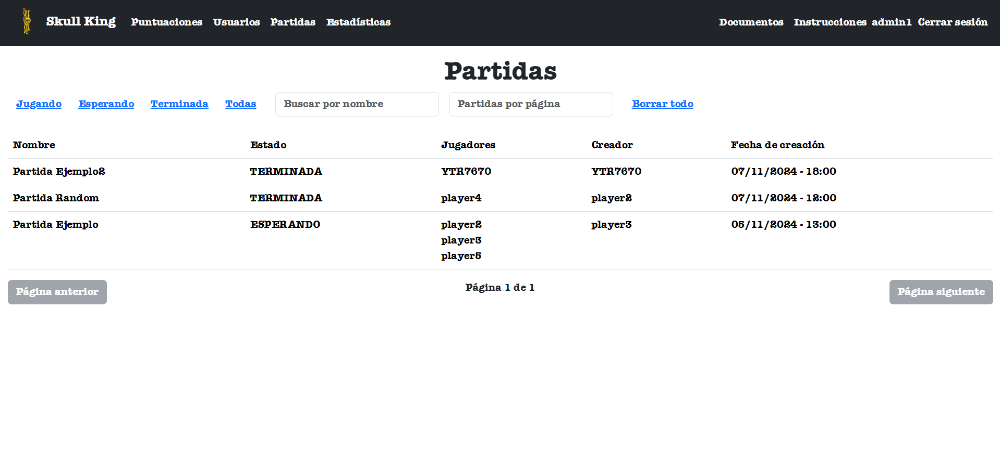|
|El administrador, en la parte superior de la pantalla, tendrá un botón 'Partidas'. Dentro de esta pantalla encontrará una barra de búsqueda para filtrar las partidas por nombre y otra para realizar paginación en función a la cantidad de partidas que quieras por página. Además, encontrará diversos botones para filtrar en función del estado de las partidas.|

### HJA2-(ISSUE#177): Ver estadísticas usuarios ([https://github.com/gii-is-DP1/DP1-2024-2025--l7-5/issues/177]())
| "Como usuario con la sesión iniciada quiero poder ver las estadísticas de los usuarios para saber cuáles son los datos de partidas de los usuarios."| 
|-----|
|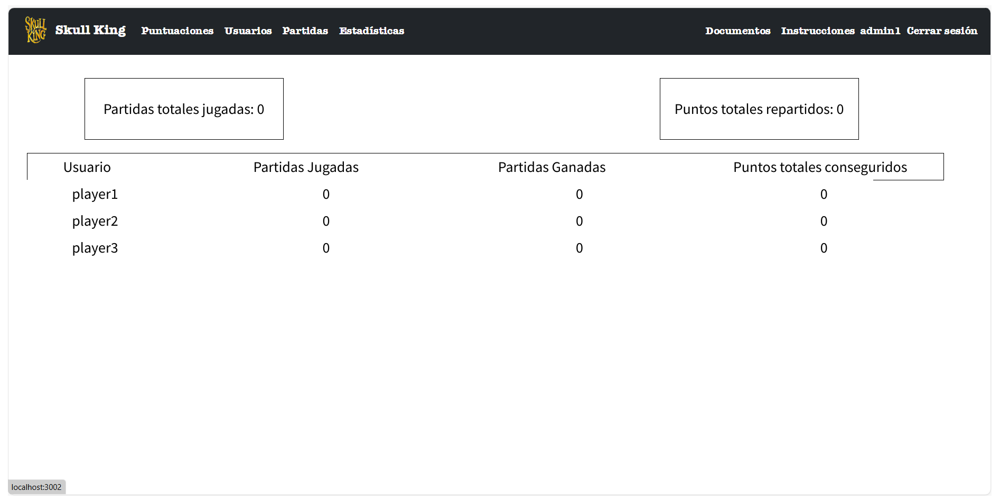|
|Cualquier usuario podrá ver las estadísticas en la pestaña con este mismo nombre.|

### HJJ1-(ISSUE#36): Jugar una carta durante mi turno ([https://github.com/gii-is-DP1/DP1-2024-2025--l7-5/issues/36]())
| "Como jugador quiero poder jugar una carta durante mi turno para intentar ganar una baza."| 
|-----|
||
|El jugador selecciona una de sus cartas disponibles siempre y cuando el juego le permita echarla en base a las reglas del juego, si no es posible, el jugador deberá escoger otra de sus cartas.|

### HJJ2-(ISSUE#37): Ver puntuación actualizada ([https://github.com/gii-is-DP1/DP1-2024-2025--l7-5/issues/37]())
| "Como jugador quiero poder ver mi puntuación actualizada tras cada ronda."| 
|-----|
||
|El jugador podrá observar su puntuación y la de sus compañeros actualizada tras cada ronda en el margen izquierdo de la pantalla. Esta se mantendrá visible durante toda la ronda siguiente hasta que se actualice al final de la ronda.|

### HJJ3-(ISSUE#38): Usar cartas especiales ([https://github.com/gii-is-DP1/DP1-2024-2025--l7-5/issues/38]())
| "Como jugador quiero poder usar cartas especiales (pirata, sirena o Skull King) en lugar del palo predominante para intentar ganar una baza."| 
|-----|
||
|El jugador selecciona una carta especial de su mano durante su turno, podrá echarla independientemente del palo que predomine durante la baza.|

### HJJ4-(ISSUE#39): Usar carta bandera blanca/de escape ([https://github.com/gii-is-DP1/DP1-2024-2025--l7-5/issues/39]())
| "Como jugador quiero poder usar una carta bandera blanca/de escape para perder una baza y acertar mi apuesta."| 
|-----|
||
|El jugador selecciona una carta bandera blanca/de escape de su mano durante su turno, podrá usarla independientemente del palo que predomine durante la baza.|

### HJJ5-(ISSUE#40): Ver apuestas de la ronda ([https://github.com/gii-is-DP1/DP1-2024-2025--l7-5/issues/40]())
| "Como jugador quiero poder ver todas las apuestas realizadas en la ronda actual para poder perjudicar las apuestas de otros jugadores."| 
|-----|
||
|El jugador podrá observar las apuestas de todos los jugadores actualizada tras cada ronda en el margen izquierdo de la pantalla. Esta se mantendrá visible durante toda la ronda hasta que se actualice en la siguiente ronda.|

### HJJ6-(ISSUE#41): Elegir rol de la carta Tigresa ([https://github.com/gii-is-DP1/DP1-2024-2025--l7-5/issues/41]())
| "Como jugador quiero poder escoger el rol de la carta Tigresa (bandera blanca o pirata) para poder cumplir con mi apuesta."| 
|-----|
||
|El jugador selecciona la carta Tigresa, aparece una ventana emergente donde le aparecerán dos botones con cada una de las opciones, deberá pulsar una de los dos para elegir el rol. Una vez pulsado el rol quedará seleccionado.|

### HJJ7-(ISSUE#175): Ver ganador de la baza ([https://github.com/gii-is-DP1/DP1-2024-2025--l7-5/issues/175]())
| "Como jugador quiero poder ver el ganador de una baza al terminar cada una de ellas para poder saber quién la ha ganado."| 
|-----|
||
|Una vez se haya llegado al fin de la baza trás echar la última carta de la baza, aparecerá un modal donde se mostrará el ganador de la misma.|

### HJJ8-(ISSUE#47): Conocer reglas de juego ([https://github.com/gii-is-DP1/DP1-2024-2025--l7-5/issues/47]())
| "Como jugador quiero conocer las reglas del juego para poder jugar correctamente."| 
|-----|
||
|Puedes acceder al PDF con todas las reglas del juego e incluso descargar dicho pdf para tenerlo en tu dispositivo.|

### HJJ9-(ISSUE#48): Crear partidas ([https://github.com/gii-is-DP1/DP1-2024-2025--l7-5/issues/48]())
| "Como jugador quiero poder crear partidas para poder jugar."| 
|-----|
||
|Puedes presionar en el botón "Crear partida" para crear una sala en la que las personas puedan entrar.|
|Caso negativo: Si ya estás en una partida en estado "JUGANDO" o "ESPERANDO", se lanzará una excepción y no podrás crear otra partida.|

### HJJ10-(ISSUE#43): Hacer apuestas ([https://github.com/gii-is-DP1/DP1-2024-2025--l7-5/issues/43]())
| "Como jugador quiero poder hacer apuestas sobre cuántas bazas ganaré para poder planificar mi estrategia."| 
|-----|
||
|Al inicio de cada ronda aparecerá una ventana emergente con botones del 0 al número de cartas repartidas en la ronda actual, el jugador deberá pulsar uno de los números en función de la predicción de bazas que cree que va a ganar en la ronda.|

### HJJ11-(ISSUE#106): Unirse a partida ([https://github.com/gii-is-DP1/DP1-2024-2025--l7-5/issues/106]())
| "Como jugador quiero poder unirme a una partida para poder jugar."| 
|-----|
||
|Puedes presionar en el botón "Unirse a partida" para unirte a una partida que esté en estado "ESPERANDO".|
|Caso negativo: Si ya estás en una partida en estado "JUGANDO" o "ESPERANDO", se lanzará una excepción y no podrás unirte a otra partida.|

### HJJ12-(ISSUE#108): Iniciar partida creada ([https://github.com/gii-is-DP1/DP1-2024-2025--l7-5/issues/108]())
| "Como jugador quiero poder iniciar una partida que he creado para poder jugar."| 
|-----|
|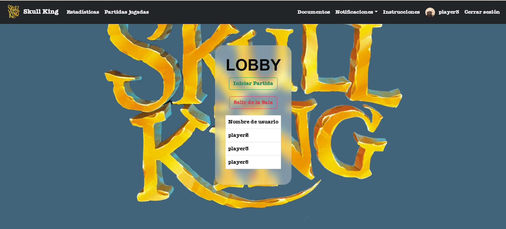|
|Una vez el jugador se encuentre en la sala de espera de la partida, si ha creado la partida, puede presionar el botón "Iniciar Partida".|
|Caso negativo: Si en la partida hay menos de 3 jugadores, no se podrá iniciar, aparecerá una excepción que lo indique.|

### HJJ13-(ISSUE#109): Ver jugadores en la sala ([https://github.com/gii-is-DP1/DP1-2024-2025--l7-5/issues/109]())
| "Como jugador quiero poder ver los jugadores que se unen a la partida para poder saber con quién voy a jugar."| 
|-----|
||
|Una vez el jugador se encuentre en la sala de espera de la partida, el jugador podrá ver los jugadores que hay en la partida. Estos se van actualizando conforme se van uniendo.|

### HJJ14-(ISSUE#155): Volver a partida esperando o en curso ([https://github.com/gii-is-DP1/DP1-2024-2025--l7-5/issues/155]())
| "Como jugador quiero poder volver a la partida empezada anteriormente."| 
|-----|
||
|Una vez el jugador se encuentre en una partida en espera o empezada, puede presionar el botón "Volver a partida".|

### HJJ15-(ISSUE#223): Salir de una sala de espera ([https://github.com/gii-is-DP1/DP1-2024-2025--l7-5/issues/223]())
| "Como jugador quiero poder salir de la sala de espera de una partida antes de que comience."| 
|-----|
||
|Una vez el jugador se encuentre en la sala de espera de una partida, el jugador podrá salir de la sala de espera para poder crear su propia partida o unirse a otra partida distinta.|

### HJJ16-(ISSUE#238): Jugar partida completa ([https://github.com/gii-is-DP1/DP1-2024-2025--l7-5/issues/238]())
| "Como jugador quiero poder jugar una partida completa para poder saber quién ha ganado."| 
|-----|
|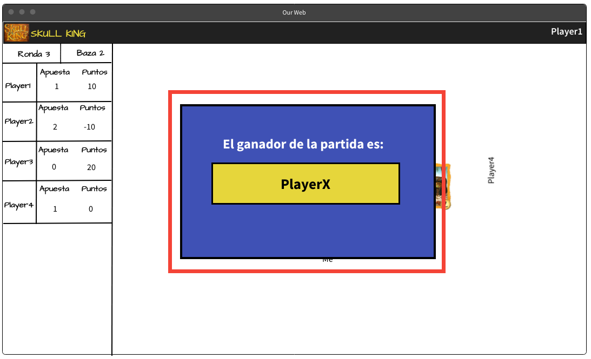|
|Una vez se haya llegado al fin de la última ronda de una partida, aparecerá un modal donde se mostrará el ganador o ganadores de la partida.|

### HJJ17-(ISSUE#239): Ver bazas ganadas en cada ronda ([https://github.com/gii-is-DP1/DP1-2024-2025--l7-5/issues/239]())
| "Como jugador quiero poder ver las bazas que gana cada uno en cada ronda para poder saber cuántas me quedan por ganar a mi o al resto."| 
|-----|
|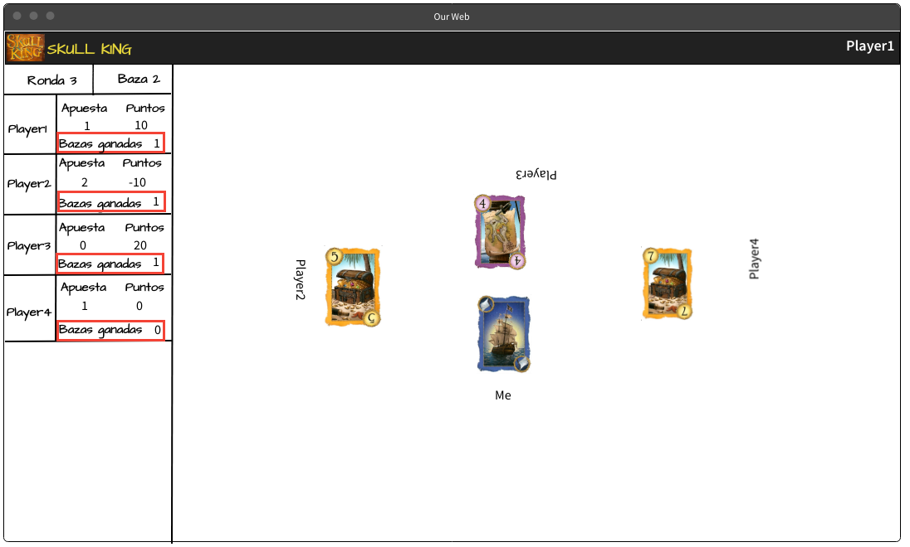|
|Cada vez que se termine una baza, se actualizarán los valores de bazas ganadas. Se renovarán al empezar cada ronda.|

### HJJ18-(ISSUE#240): Saber ronda y baza actual ([https://github.com/gii-is-DP1/DP1-2024-2025--l7-5/issues/240]())
| "Como jugador quiero poder saber la ronda y baza actual para saber cuánto me queda de la partida"| 
|-----|
|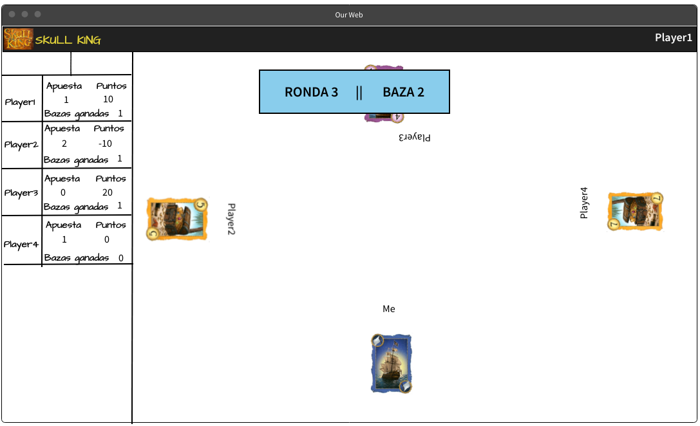|
|Cada vez que comience una ronda o una baza, aparecerá una alerta indicando la ronda y baza en la que se encuentra la partida.|

### HJJ19-(ISSUE#146): Ver listado de mis partidas ordenadas y por filtros ([https://github.com/gii-is-DP1/DP1-2024-2025--l7-5/issues/146]())
| "Como jugador quiero poder ver el listado de partidas que he jugado, incluyendo nombre de la partida, estado, jugadores participantes, si la he creado yo o no y la fecha de creación para llevar un control de las partidas en las que participado."| 
|-----|
||
|El jugador, en la parte superior de la pantalla, tendrá un botón 'Partidas jugadas'. Dentro de esta pantalla encontrará una barra de búsqueda para filtrar las partidas por nombre y otra para realizar paginación en función a la cantidad de partidas que quieras por página. Además, encontrará diversos botones para filtrar en función del estado de las partidas.|

### HSJ1-(ISSUE##228): Chat en partida ([https://github.com/gii-is-DP1/DP1-2024-2025--l7-5/issues/228]())
| "Como jugador quiero poder comunicarme con los jugadores de la partida para poder crear estrategias y aliarme con otros jugadores."| 
|-----|
|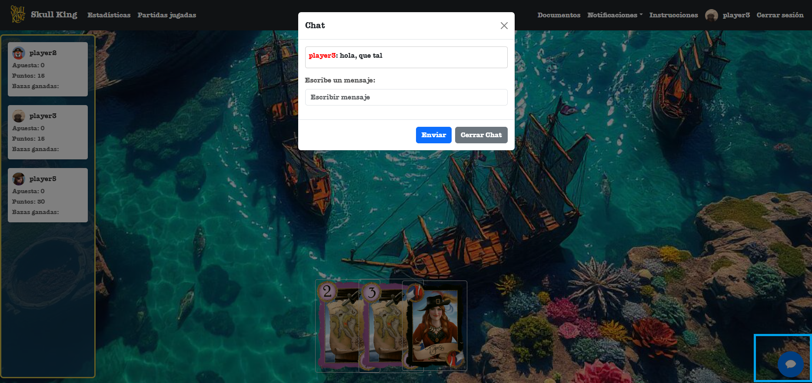|
|Una vez dentro de la partida el jugador tendrá en la parte inferior derecha de la pantalla el botón 'Chat'. el cuál abre un modal que contiene en la parte superior los mensajes enviados por todos los jugadores del chat. En la parte inferior se encuentra una barra en la cuál puedes escribir el mensaje y finalmente dos botones, uno para enviar el mensaje y otro para cerrar el chat.|

### HSJ2-(ISSUE##229): Enviar solicitud de amistad ([https://github.com/gii-is-DP1/DP1-2024-2025--l7-5/issues/229]())
| "Como jugador quiero poder enviarle una solicitud de amistad a otro jugador para ser amigos."| 
|-----|
|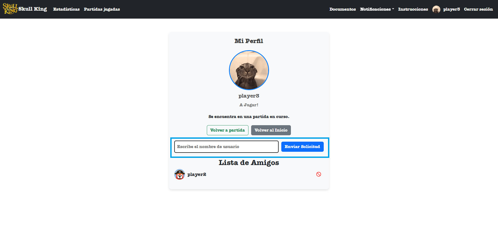|
|En la pantalla de perfil el usuario tendrá una barra en la cuál podrá escribir el nombre de usuario y tendrá un botón 'Enviar solicitud', el cuál enviará la solicitud a la persona cuyo nombre de usuario hayas escrito.|

### HSJ3-(ISSUE##247): Ver, aceptar y rechazar solicitudes de amistad ([https://github.com/gii-is-DP1/DP1-2024-2025--l7-5/issues/247]())
| "Como jugador quiero poder ver todas mis solicitudes de amistad para poder aceptarlas o rechazarlas."| 
|-----|
|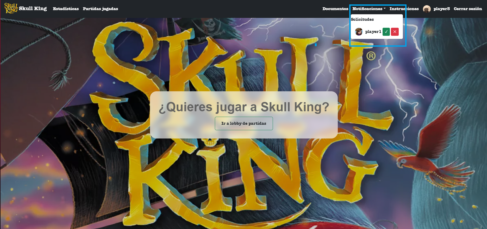|
|En la parte superior, en la barra de navegación está el botón "Notificaciones", el cuál una vez presionado te mostrará, entre otras opciones, tus solicitudes de amistad en las que aparece el nombre de usuario del remitente y dos botones, uno para aceptar la solicitud y otro para rechazarla.|

### HSJ4-(ISSUE##248): Ver a mis amigos conectados ([https://github.com/gii-is-DP1/DP1-2024-2025--l7-5/issues/248]())
| "Como jugador quiero poder ver a todos mis amigos que están conectados para poder saber con quién puedo jugar."| 
|-----|
|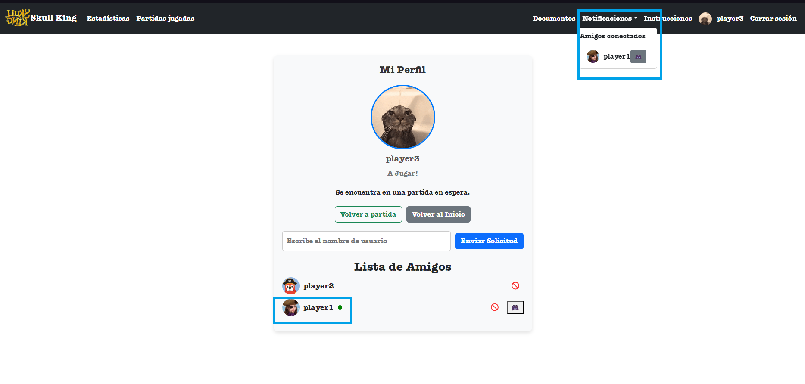|
|Puedes ver a tus amigos conectados de dos formas, desde la pantalla de perfil en la lista de amigos aparece un círculo en verde al lado del nombre indicando que dicho amigo está conectado o desde la barra de navegacion en el botón de 'Notificaciones' en la cuál aparece una lista con tus amigos conectados.|

### HSJ5-(ISSUE##250): Dejar de ser amigos ([https://github.com/gii-is-DP1/DP1-2024-2025--l7-5/issues/250]())
| "Como jugador quiero poder dejar de ser amigo de un jugador para evitar que me envie invitaciones a jugar."| 
|-----|
|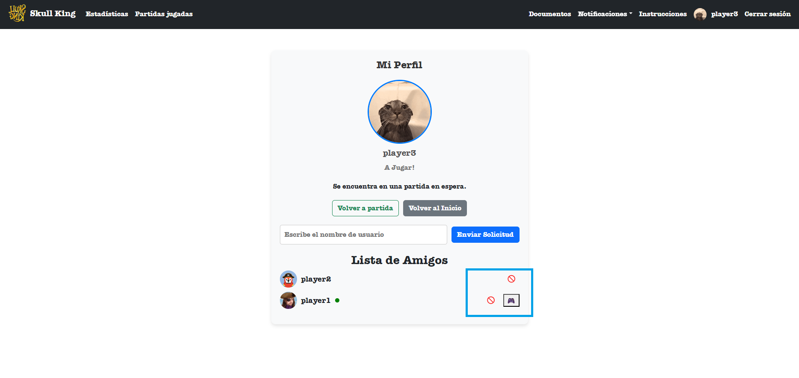|
|Puedes romper la amistad con un jugador desde la pantalla de perfil, en la sección de lista de amigos aparece un botón el cuál te permite dejar de ser amigo, una vez lo presionas aparece un modal pidiendo la confirmación para romper la amistad.|

### HSJ6-(ISSUE##249): Invitar a jugar o a espectar mi partida ([https://github.com/gii-is-DP1/DP1-2024-2025--l7-5/issues/249]())
| "Como jugador quiero poder enviarle una invitación a mis amigos para que jueguen conmigo o me vean jugar una partida."| 
|-----|
|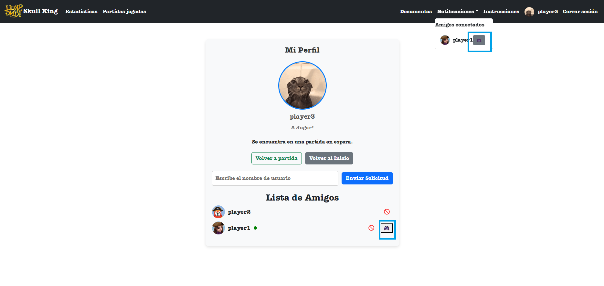|
|Puedes invitar a tus amigos de dos formas, desde la pantalla de perfil en la lista de amigos si dicho amigo está conectado, ya que aparecerá un botón para poder  enviarle una invitación; o desde la barra de navegación en el botón 'Notificaciones' donde también aparecerá el botón para invitarlo a jugar o espectar en función del estado de la partida.|

### HSJ7-(ISSUE##252): Ver, aceptar y rechazar invitaciones a partida ([https://github.com/gii-is-DP1/DP1-2024-2025--l7-5/issues/252]())
| "Como jugador quiero poder ver todas mis invitaciones para poder aceptarlas o rechazarlas, ya sean para jugar o para espectar."| 
|-----|
|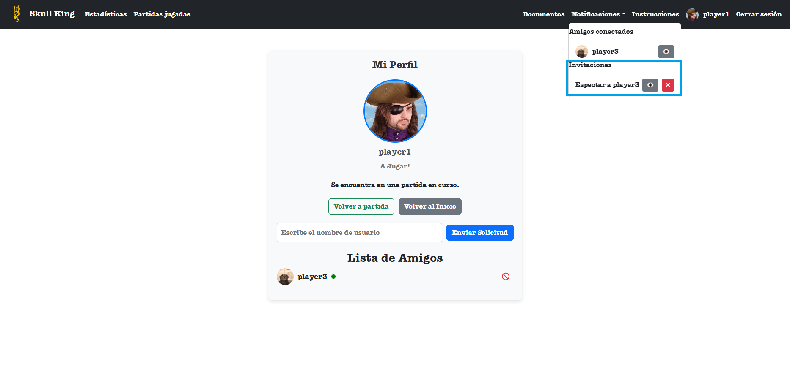|
|Puedes ver todas tus invitaciones desde el botón 'Notificaciones', en el cuál entre las opciones aparecerán tus invitaciones pendientes y dos botones, uno para aceptar la invitación y otro para rechazarla.|

### HSJ8-(ISSUE##251): Espectar partidas ([https://github.com/gii-is-DP1/DP1-2024-2025--l7-5/issues/251]())
| "Como jugador quiero poder espectar las partidas de mis amigos para poder ver cómo juegan."| 
|-----|
|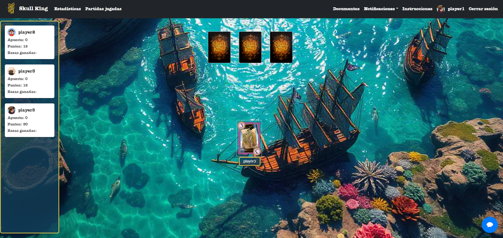|
|Puedes espectar la partida de tus compañeros una vez aceptes la invitación desde el apartado 'Notificaciones', una vez aceptada se te redireccionará a la partida en cuestión.|

### HSJ9-(ISSUE##270): Visualizar ranking de usuarios por puntos([https://github.com/gii-is-DP1/DP1-2024-2025--l7-5/issues/270]())
| "Como usuario quiero poder ver el ranking de usuarios por puntos para saber mi posición en la clasificación"| 
|-----|
|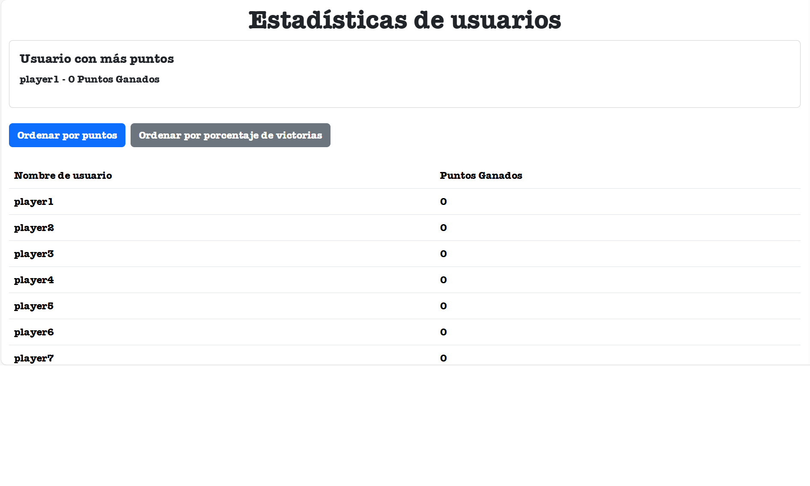|
|Pulsando sobre el botón 'Ordenar por puntos' puedes ver la clasificaicón de los usuarios ordenados en función del total de puntos que han adquirido en las distintas partidas que han jugado y al usuario con más puntos.|

### HSJ10-(ISSUE##270): Visualizar ranking de usuarios por victorias ([https://github.com/gii-is-DP1/DP1-2024-2025--l7-5/issues/270]())
| "Como usuario quiero poder ver el ranking de usuarios por victorias para saber mi posición en la clasificación"| 
|-----|
|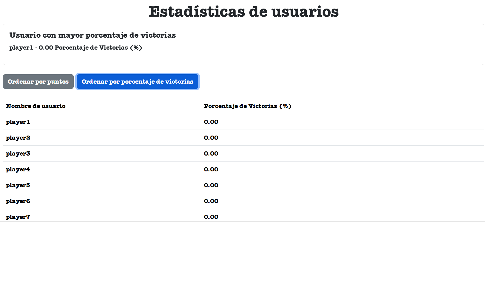|
|Pulsando sobre el botón 'Ordenar por porcentaje de victorias' puedes ver la clasificaicón de los usuarios ordenados en función del porcentaje de victorias que tienen en el juego, es decir, ordenados en función de cual tiene mayor número de partidas ganadas en función del número de partidas totales que ha jugado y al usuario mayor porcentaje.|

### HSJ11-(ISSUE##269): Visualizar estadísticas globales de la duración de las partidas ([https://github.com/gii-is-DP1/DP1-2024-2025--l7-5/issues/269]())
| "Como usuario quiero poder visualizar las estadísticas sobre la duración de todas las partidas jugadas para saber la media de lo que suele durar una partida, lo máximo y lo mínimo que se ha llegado a tardar en jugar una partida y el tiempo total que los usuarios han invertido en el juego"| 
|-----|
|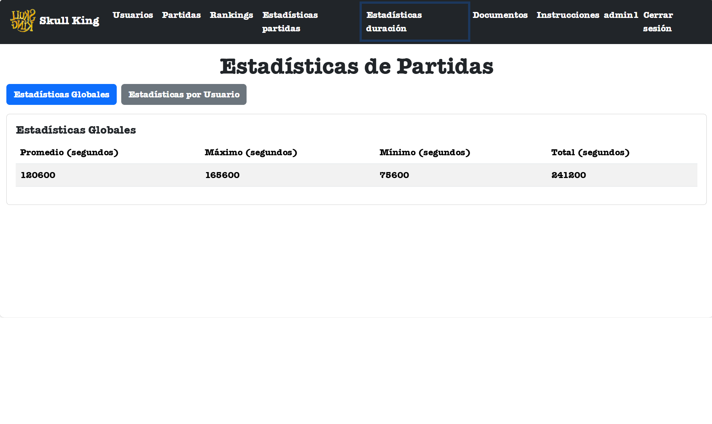|
|Pulsando sobre el botón 'Estadísticas globales' se puede ver la duración media de una partida de skullking, el tiempo máximo y mínimo que ha llegado a durar una partida del juego y el tiempo que todos los usuarios han invertido en el juego.|

### HSJ12-(ISSUE##269): Visualizar estadísticas por usuario de la duración de las partidas ([https://github.com/gii-is-DP1/DP1-2024-2025--l7-5/issues/269]())
| "Como usuario quiero poder visualizar las estadísticas de cada usuario sobre la duración de todas las partidas a las que ha jugado para saber la media de lo que suele durarle a dicho usuario una partida, el tiempo máximo y mínimo que ha tardado ese usuario en jugar una partida y el tiempo total que el suuario ha jugado al juego"| 
|-----|
|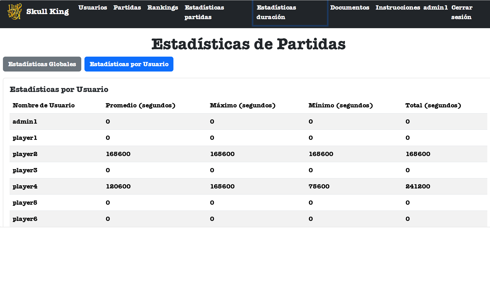|
|Pulsando sobre el botón 'Estadísticas por usuario' se puede ver para cada usaurio la media de tiempo que suele tardar en jugar una partida, el tiempo máximo y mínimo que ha llegado a estar jugando una partida y el tiempo total que ha estado jugando al juego.|

### HSJ13-(ISSUE##268): Visualizar estadísticas globales del número de partidas jugadas ([https://github.com/gii-is-DP1/DP1-2024-2025--l7-5/issues/268]())
| "Como usuario quiero poder ver las estadísticas globales sobre el número de partidas jugadas para saber el número medio de partidas que suele jugar un único usuario y el número máximo y mínimo de partidas a las que ha jugado un usuario"| 
|-----|
|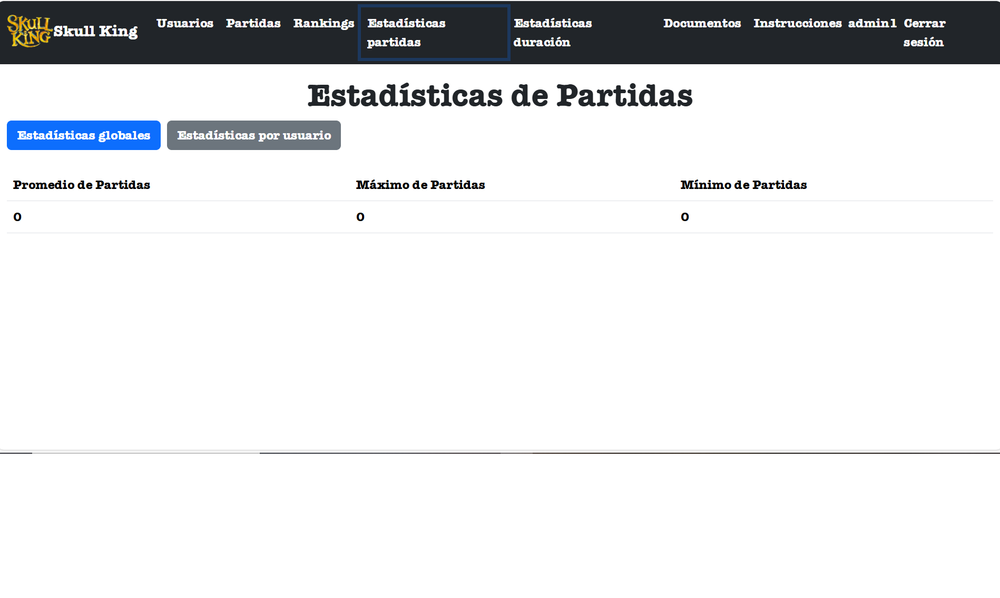|
|Pulsando sobre el botón 'Estadísticas globales' se puede ver la media de partidas que suele jugar un único usuario y el número máximo y mínimo de partidas a las que ha jugado un usuario.|

### HSJ14-(ISSUE##268): Visualizar estadísticas por usuario del número de partidas jugadas ([https://github.com/gii-is-DP1/DP1-2024-2025--l7-5/issues/268]())
| "Como usuario quiero poder ver las estadísticas por usuario sobre el número de partidas a las que ha jugado para saber el número total de partidas a las que ha jugado cada usuario"| 
|-----|
||
|Pulsando sobre el botón 'Estadísticas por usuario' se puede ver el número total de partidas jugadas por cada usuario.|

## Diagrama conceptual del sistema
En esta sección proporcionamos un diagrama UML de clases que describe el modelo de datos a implementar en la aplicación. Este diagrama esta anotado con las restricciones simples de los datos a gestionar por la aplicación.

## Reglas de Negocio
### R0 - Cartas en la baraja 
Las cartas que conforman las manos de una ronda concreta no se pueden repetir.

### R1 - Bazas de vuelta a la baraja  
Al finalizar cada baza, esta permanecerá en la mesa del jugador ganador. Una vez finalizada la ronda, todas las bazas vuelven a la baraja.

### R2 - Jugadores en partida  
Previo al comienzo de la partida se deberá tener como mínimo 3 jugadores. Al cumplir con esta condición se podrá dar inicio al juego. A su vez, será necesario comprobar que no se supere la cantidad de 8 jugadores.

### R3 - Número de cartas en cada ronda normal  
El número de cartas a repartir estará determinado por el número de ronda en la que se encuentre la partida, siendo la última la ronda 10.  
Existe un caso especial en las partidas de más de 6 jugadores. En este caso, la partida alcanzará un punto en el que no se podrán repartir el mismo número de cartas que de ronda. Por ello, se repartirán el máximo de cartas posibles a cada jugador, siendo estas la misma cantidad.

### R4 - Realizar apuesta  
Al comenzar cada ronda, posterior al reparto de cartas, en función de tu mano se deberá hacer una apuesta.

### R5 - Apuesta válida  
La apuesta de cada jugador deberá ser menor o igual al número de cartas en mano y mayor o igual a 0.

### R6 - Obtención de puntos  
La única forma de obtener puntos en el juego es acertar la apuesta realizada a inicios de la ronda.

### R7 - Obtención de puntos de bonificación  
Para obtener puntos de bonificación se deberá acertar la apuesta realizada a inicios de ronda.

### R8 - Palo de la baza  
La definición del palo de la ronda vendrá determinada por la carta tirada en primer lugar.

### R9 - Palo de la baza: bandera blanca  
La definición del palo de la ronda vendrá determinada por la carta tirada tras la bandera blanca. En caso de que se emplee esta carta nuevamente, el palo será definido por el siguiente jugador.

### R10 - Palo de la baza: carta personaje  
En caso de que el primer jugador juegue una carta de personaje, la baza no tendrá un palo principal.

### R11 - Palo principal  
El jugador deberá jugar una carta del palo principal, en caso de no tener, se tirará cualquier carta de su elección.

### R12 - Cartas especiales  
Si el jugador posee alguna carta especial, este podrá jugarla independientemente del palo principal.

### R13 - Carta de huida  
Al jugar una carta de huida se perderá la baza en la que se juegue, a menos que todas las cartas jugadas en la misma baza sean de huida o Tigresa como un huida, pues la primera carta jugada ganará la baza.

### R14 - Carta de personajes: Tigresa  
Si se quiere jugar la carta Tigresa, una vez puesta en mesa, se deberá elegir el tipo de papel que interpretará, bandera blanca o pirata.

### R15 - Definición del primer jugador  
Al iniciar la partida se elegirá de forma aleatoria al jugador que comenzará la baza de la primera ronda. En cada baza nueva, el jugador que comenzará será el siguiente al que comenzó en la baza anterior, siguiendo el sentido horario.

### R16 - Turnos  
El turno de cada jugador vendrá determinado por el sentido horario.

### R17 - Ganador de baza  
El ganador de la baza será aquel cuyo truco sea el más alto, respetando la jerarquía.

### R18 - Ganador de la partida  
El ganador de la partida será aquel cuya puntaje sea el mayor en comparación con el resto de jugadores.

### R19 - Finalización de ronda  
La ronda finaliza una vez se jueguen las bazas de dicha ronda.

### R20 - Finalización de partida  
La partida finaliza una vez se haya calculado la puntuación final.

### R21 - Cálculo de puntos de ronda  
El cálculo de los puntos de la ronda se realizará al finalizar esta.

### R22 - Usuario un jugador por partida
Cada usuario tendrá asociado un solo jugador en una partida.

### R23 - Usuario jugador distinto por partida
El jugador asociado al usuario será distinto en cada partida.

### R24 - Usuario con varios jugadores  
El usuario en la aplicación, a medida que juegue partidas podrá tener distintos jugadores. Sin embargo, nunca podrán haber dos jugadores del mismo usuario jugando al mismo tiempo, es decir, un usuario no podrá tener varios jugadores que se encuentren en partidas con estado "ESPERANDO" o "JUGANDO".

### R25 - 3 Cartas de personajes distintas  
En el caso de que en mesa se hayan jugado las 3 cartas de personaje (Skull King, Pirata y Sirena), la primera sirena jugada ganará la ronda.

### R26 - Todas las cartas banderas blancas  
En el caso de que en mesa todos los jugadores hayan jugado bandera blanca (también puede ser la tigresa jugada como bandera blanca), ganará el truco tirada en primer lugar.

### R27 - Relación Skull King - Pirata  
En el caso de que en mesa se haya jugado un Skull King y uno o varios piratas, ganará el Skull King.

### R28 - Relación Pirata - Sirena  
En el caso de que en mesa se hayan jugado uno o varios piratas y una o varias sirenas, ganará el primer pirata jugado.

### R29 - Cartas triunfo  
En el caso de que no se haya jugado ninguna carta de personaje y haya en mesa uno o más triunfos, ganará el de mayor número.

### R30 - Cartas del palo principal  
En el caso de que no se haya jugado ninguna carta de personaje ni triunfo, ganará el truco de mayor número del palo principal.

### R31 - Apostar a ganar: acierto de apuesta  
Si el jugador establece que ganará al menos 1 baza, y acierta la apuesta, el número de bazas ganadas se multiplicará por 20 puntos.

### R32 - Apostar a ganar: apuesta no acertada  
Si el jugador establece que ganará al menos 1 baza, y no acierta la apuesta, el número de bazas apostadas a ganar y no se han ganado se multiplicará por -10 puntos.

### R33 - Apostar a perder: acierto de apuesta  
Si el jugador establece que perderá todas las bazas de la ronda, y acierta la apuesta, el número de bazas de la ronda se multiplicará por 10 puntos.

### R34 - Apostar a perder: apuesta no acertada  
Si el jugador establece que perderá todas las bazas de la ronda, y no acierta la apuesta, el número de bazas de la ronda se multiplicará por -10 puntos.

### R35 - Puntos de bonificación: carta 14 de palo  
Una vez se compruebe que se ha acertado la apuesta, si el jugador ha ganado alguna baza que incluya alguna carta 14 de los palos normales, se sumarán 10 puntos por cada una a su puntuación de la ronda.

### R36 - Puntos de bonificación: carta 14 de triunfo  
Una vez se compruebe que se ha acertado la apuesta, si el jugador ha ganado alguna baza que incluya alguna carta 14 de triunfo, se sumarán 20 puntos a su puntuación de la ronda.

### R37 - Puntos de bonificación: sirena capturada  
Una vez se compruebe que se ha acertado la apuesta, si el jugador ha ganado alguna baza que incluya alguna carta de sirena, se sumarán 20 puntos por cada una a su puntuación de la ronda.

### R38 - Puntos de bonificación: pirata capturado  
Una vez se compruebe que se ha acertado la apuesta, si el jugador ha ganado alguna baza que incluya alguna carta de pirata, se sumarán 20 puntos por cada uno a su puntuación de la ronda.

### R39 - Puntos de bonificación: Skull King capturado  
Una vez se compruebe que se ha acertado la apuesta, si el jugador ha ganado alguna baza que incluya la carta de Skull King, se sumarán 40 puntos a su puntuación de la ronda.

### R40 - Puntos de bonificación: 3 cartas de personaje distintos  
Una vez se compruebe que se ha acertado la apuesta, si el jugador ha ganado alguna baza que incluya los 3 tipos de personaje, se aplicará la regla de puntos de bonificación de Skull King capturado.

### R41 - Nombre partida
No pueden existir dos partidas en curso o en espera con el mismo nombre.

### R42 - Tiempo de apuesta
Tras el reparto de cartas se deberá apostar dentro del tiempo establecido (20 segundos), en otro caso, la apuesta se establecerá a 0.

### R43 - Borrar su propio usuario
Una vez te encuentras en la sala de espera de una partida o en una partida en curso no podrás borrar tu propia cuenta hasta que no termines la partida.

### R44 - Editar su propio usuario
Una vez te encuentras en la sala de espera de una partida o en una partida en curso no podrás editar ninguna información de tu propia cuenta hasta que no termines la partida.

### R45 - Borrar un usuario siendo administrador
Si el usuario a eliminar tiene un jugador en la sala de espera de una partida o en una partida en curso no podrá borrar el usuario hasta que no termine la partida.

### R46 - Editar un usuario siendo administrador
Si el usuario a editar tiene un jugador en la sala de espera de una partida o en una partida en curso no podrá editar el usuario hasta que no termine la partida.

### R47 - Salir de una sala de espera siendo el dueño
Si el jugador que quiere salir de una sala de espera es el creador de la partida, al salir de la sala de espera el dueño de la partida será el siguiente jugador que entró en la sala.

### R48 - No puedes ser tu propio amigo

El usuario no podra enviarse una solicitud de amistad a si mismo

### R49 - No puedes enviar mas de una solicitud de amistad a un mismo usuario

El usuario no podra enviarle multiples solicitudes de amistad a un mismo usuario, sin importar que el estado sea pendiente, aceptado o rechazado

### R50 - No puedes invitar mas de una vez a un usuario a partida

El usuario no podra enviar multiples invitaciones a un mismo usuario
