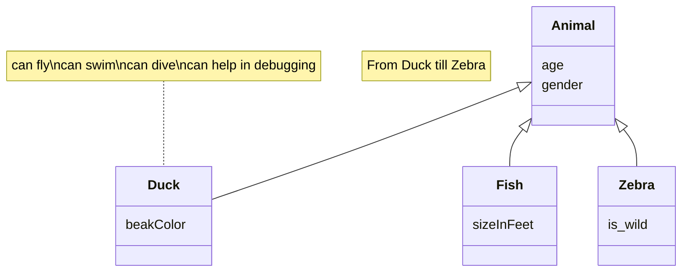

# Documento de análisis de requisitos del sistema

_Esta es una plantilla que sirve como guía para realizar este entregable. Por favor, mantén las mismas secciones y los contenidos que se indican para poder hacer su revisión más ágil._ 

## Introducción

_En esta sección debes describir de manera general cual es la funcionalidad del proyecto a rasgos generales. ¿Qué valor puede aportar? ¿Qué objetivos pretendemos alcanzar con su implementación? ¿Cuántos jugadores pueden intervenir en una partida como máximo y como mínimo? ¿Cómo se desarrolla normalmente una partida?¿Cuánto suelen durar?¿Cuando termina la partida?¿Cuantos puntos gana cada jugador o cual es el criterio para elegir al vencedor?_

[Enlace al vídeo de explicación de las reglas del juego / partida jugada por el grupo](http://youtube.com)

## Tipos de Usuarios / Roles

< Nombre Rol >: < Breve descripción del rol >

_Ej1: Propietario: Dueño de una o varias mascota que viene a la clínica para mantenerla sana y cuidar de su salud._

_Ej2: Veterinario: Profesional de la salud animal con titulación universitaria homologada, está registrado en la clínica y se encarga de realizar diagnósticos y recetar tratamientos. Además mantiene actualizado el vademécum._

_Ej3: Administrador: Dueño de la clínica que se encarga de dar de alta veterinarios y gestionar la información registrada en la aplicación de la clínica._

## Historias de Usuario

A continuación se definen  todas las historias de usuario a implementar:
_Os recomentamos usar la siguiente plantilla de contenidos que usa un formato tabular:_
 ### HJJ8-(ISSUE#47): Conocer reglas de juego ([https://github.com/gii-is-DP1/DP1-2024-2025--l7-5/issues/47#issue-2565864686]()
| "Como Jugador quiero conocer las reglas del juego para poder jugar correctamente"| 
|-----|
||
|Puedes acceder al pdf con todas las reglas del juego e incluso descargar dico pdf para tenerlo en tu computadora |

 ### HJJ9-(ISSUE#48): Crear partidas ([https://github.com/gii-is-DP1/DP1-2024-2025--l7-5/issues/48#issue-2565866251]()
| "Como jugador quiero poder crear partidas para poder jugar"| 
|-----|
||
|Puedes presionar en el boton crear partida, para crear una sala en la que las personas puedan entrar|

 ### HGJ1-(ISSUE#49): Registrar usuarios ([https://github.com/gii-is-DP1/DP1-2024-2025--l7-5/issues/49#issue-2565870591]()
| "Como jugador quiero poder registrarme en el juego para poder jugar al mismo"| 
|-----|
||
||
|Puedes presionar el boton "player" para registrate como jugador, esto te enviara a un formulario en el cual simplemente debes introducir los datos indicados y presionar "save" para guardar tu perfil |

 ### HGJ2-(ISSUE#50): Hacer log-in ([https://github.com/gii-is-DP1/DP1-2024-2025--l7-5/issues/50#issue-2565890369]()
| "Como jugador quiero poder loguearme en el juego para jugar desde mi usuario"| 
|-----|
||
|Tienes que rellenar los datos solicitados para verificar que efectivamente es tu usuario, finalmente puedes presionar "Log-in" en el cual si los datos son correctos entraras en tu perfil, caso contrario deberas introducirlos nuevamente |

 ### HGJ3-(ISSUE#51): Hacer log-out ([https://github.com/gii-is-DP1/DP1-2024-2025--l7-5/issues/51#issue-2565892501]()
| "Como jugador quiero poder hacer log-out para salirme de mi usuario y evitar que otras personas lo usen"| 
|-----|
||
| Siempre y cuando estes logado, aparecera en el navbar el boton "log-out", una vez presionado ya no estaras logeado en tu perfil |

 ### HGJ4-(ISSUE#52): Editar perfil de usuario  ([https://github.com/gii-is-DP1/DP1-2024-2025--l7-5/issues/52#issue-2565901340]()
| "Como jugador quiero poder editar mi perfil para poner mi información correctamente."| 
|-----|
||
|  |

 ### HGA1-(ISSUE#30): Ver usuarios registrados ([https://github.com/gii-is-DP1/DP1-2024-2025--l7-5/issues/30#issue-2561421045]()
| "Como administrador quiero ver el listado de usuarios registrados para llevar un control sobre la cantidad de usuarios en el sistema."|
|-----|
||
| Se despliega una lista de todos los usuarios registrados en el sistema |

 ### HGA4-(ISSUE#53): CRUD de usuarios ([https://github.com/gii-is-DP1/DP1-2024-2025--l7-5/issues/53#issue-2565933479]()
| "Como administrador quiero poder crear, ver, actualizar y borrar usuarios para llevar un control adecuado de los usuarios del sistema."|
|-----|
||
| En la lista de usuarios tienes las opciones para editar los datos de los usuarios usando el boton edit, crear uno con el boton "add user" y eliminarlo usando delete, ademas haciendo clieck en el nombre del usuario puedes ver su perfil |

 ### HGA5-(ISSUE#54): Restablecer ([https://github.com/gii-is-DP1/DP1-2024-2025--l7-5/issues/54#issue-2565956464]()
| "Como administrador quiero poder restablecer la contraseña de un usuario para ayudar a los jugadores que hayan olvidado sus credenciales."|
|-----|
||
| en el formulario que aparece puedes modificar los datos en el apartado de contraseña para cambiar las credenciales del usuario especificado |

## Diagrama conceptual del sistema
_En esta sección debe proporcionar un diagrama UML de clases que describa el modelo de datos a implementar en la aplicación. Este diagrama estará anotado con las restricciones simples (de formato/patrón, unicidad, obligatoriedad, o valores máximos y mínimos) de los datos a gestionar por la aplicación. _

_Recuerde que este es un diagrama conceptual, y por tanto no se incluyen los tipos de los atributos, ni clases específicas de librerías o frameworks, solamente los conceptos del dominio/juego que pretendemos implementar_
Ej:

_Si vuestro diagrama se vuelve demasiado complejo, siempre podéis crear varios diagramas para ilustrar todos los conceptos del dominio. Por ejemplo podríais crear un diagrama para cada uno de los módulos que quereis abordar. La única limitación es que hay que ser coherente entre unos diagramas y otros si nos referimos a las mismas clases_

_Puede usar la herramienta de modelado que desee para generar sus diagramas de clases. Para crear el diagrama anterior nosotros hemos usado un lenguaje textual y librería para la generación de diagramas llamada Mermaid_

_Si deseais usar esta herramienta para generar vuestro(s) diagramas con esta herramienta os proporcionamos un [enlace a la documentación oficial de la sintaxis de diagramas de clases de _ermaid](https://mermaid.js.org/syntax/classDiagram.html)_

## Reglas de Negocio
### R-< X > < Nombre Regla de negocio >
_< Descripción de la restricción a imponer >_

_Ej:_ 
### R1 – Diagnósticos imposibles
El diagnóstico debe estar asociado a una enfermedad que es compatible con el tipo de mascota de su visita relacionada. Por ejemplo, no podemos establecer como enfermedad diagnosticada una otitis cuando la visita está asociada a una mascota que es un pez, porque éstos no tienen orejas ni oídos (y por tanto no será uno de los tipos de mascota asociados a la enfermedad otitis en el vademecum).

…

_Muchas de las reglas del juego se transformarán en nuestro caso en reglas de negocio, por ejemplo, “la carta X solo podrá jugarse en la ronda Y si en la ronda anterior se jugó la carta Z”, o “en caso de que un jugador quede eliminado el turno cambia de sentido”_

