# Documento de análisis de requisitos del sistema

_Esta es una plantilla que sirve como guía para realizar este entregable. Por favor, mantén las mismas secciones y los contenidos que se indican para poder hacer su revisión más ágil._ 

## Introducción

_En esta sección debes describir de manera general cual es la funcionalidad del proyecto a rasgos generales. ¿Qué valor puede aportar? ¿Qué objetivos pretendemos alcanzar con su implementación? ¿Cuántos jugadores pueden intervenir en una partida como máximo y como mínimo? ¿Cómo se desarrolla normalmente una partida?¿Cuánto suelen durar?¿Cuando termina la partida?¿Cuantos puntos gana cada jugador o cual es el criterio para elegir al vencedor?_

[Enlace al vídeo de explicación de las reglas del juego / partida jugada por el grupo](http://youtube.com)

## Tipos de Usuarios / Roles

< Nombre Rol >: < Breve descripción del rol >

_Ej1: Propietario: Dueño de una o varias mascota que viene a la clínica para mantenerla sana y cuidar de su salud._

_Ej2: Veterinario: Profesional de la salud animal con titulación universitaria homologada, está registrado en la clínica y se encarga de realizar diagnósticos y recetar tratamientos. Además mantiene actualizado el vademécum._

_Ej3: Administrador: Dueño de la clínica que se encarga de dar de alta veterinarios y gestionar la información registrada en la aplicación de la clínica._

## Historias de Usuario

A continuación se definen todas las historias de usuario a implementar:

 ### HJJ1-(ISSUE#36): Jugar una carta durante mi turno ([https://github.com/gii-is-DP1/DP1-2024-2025--l7-5/issues/36]())
| "Como jugador quiero poder jugar una carta durante mi turno para intentar ganar una baza."| 
|-----|
|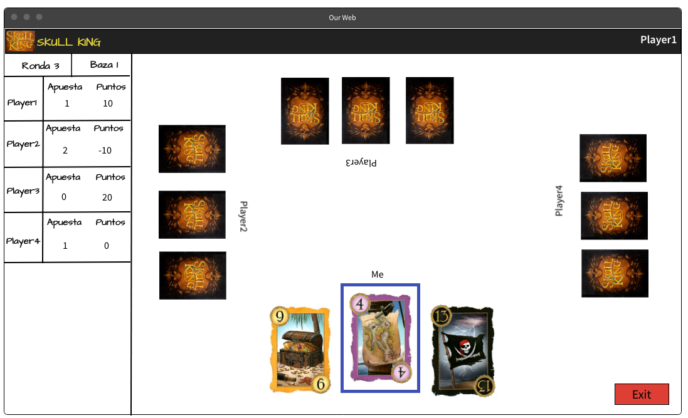|
|El jugador selecciona una de sus cartas disponibles siempre y cuando el juego le permita echarla en base a las reglas del juego, si no es posible, el jugador deberá escoger otra de sus cartas.|

 ### HJJ2-(ISSUE#37): Ver puntuación actualizada ([https://github.com/gii-is-DP1/DP1-2024-2025--l7-5/issues/37]())
| "Como jugador quiero poder ver mi puntuación actualizada tras cada ronda para saber si voy ganando o no."| 
|-----|
|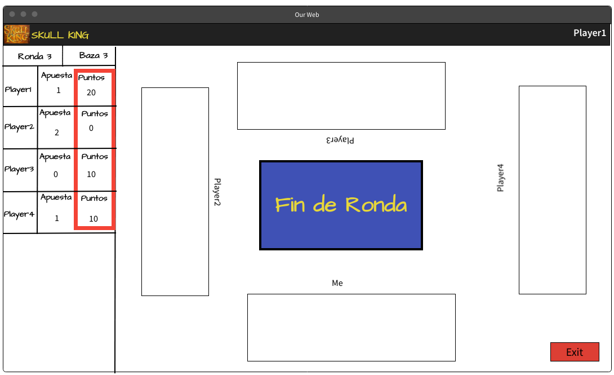|
|El jugador podrá observar su puntuación y la de sus compañeros actualizada tras cada ronda en el margen izquierdo de la pantalla. Esta se mantendrá visible durante toda la ronda siguiente hasta que se actualice al final de la ronda.|

 ### HJJ3-(ISSUE#38): Usar cartas especiales ([https://github.com/gii-is-DP1/DP1-2024-2025--l7-5/issues/38]())
| "Como jugador quiero poder usar cartas especiales (pirata, sirena o Skull King) en lugar del palo predominante para intentar ganar una baza."| 
|-----|
|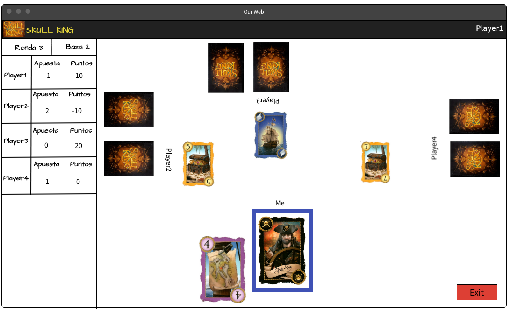|
|El jugador selecciona una carta especial de su mano durante su turno, podrá echarla independientemente del palo que predomine durante la baza.|

 ### HJJ4-(ISSUE#39): Usar carta blanca/de escape ([https://github.com/gii-is-DP1/DP1-2024-2025--l7-5/issues/39]())
| "Como jugador quiero poder usar una carta blanca/de escape para perder una baza y acertar mi apuesta."| 
|-----|
|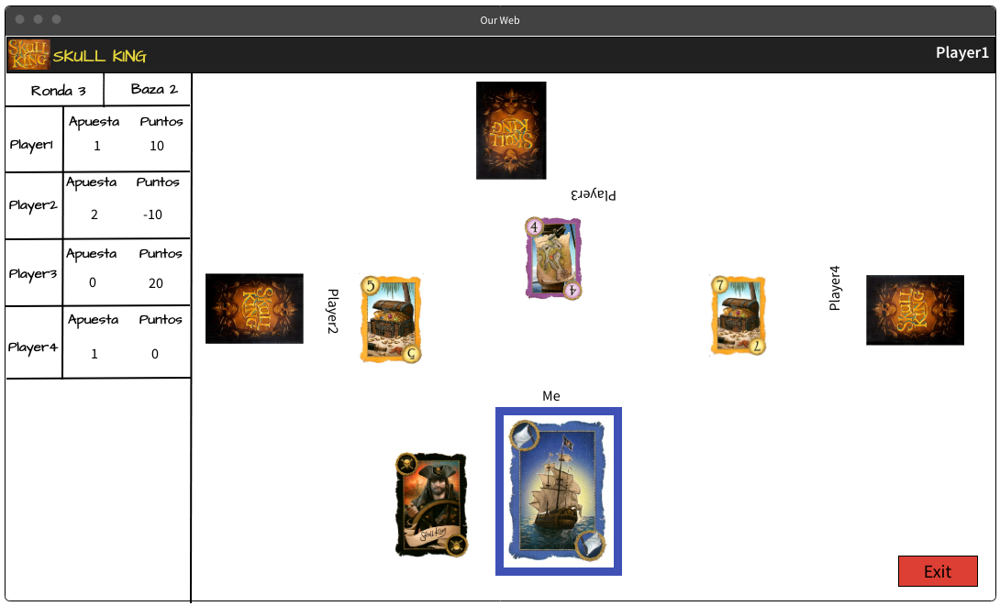|
|El jugador selecciona una carta blanca/de escape de su mano durante su turno, podrá echarla independientemente del palo que predomine durante la baza.|

 ### HJJ5-(ISSUE#40): Ver apuestas de la ronda ([https://github.com/gii-is-DP1/DP1-2024-2025--l7-5/issues/40]())
| "Como jugador quiero poder ver todas las apuestas realizadas en la ronda actual para poder perjudicar las apuestas de otros jugadores."| 
|-----|
|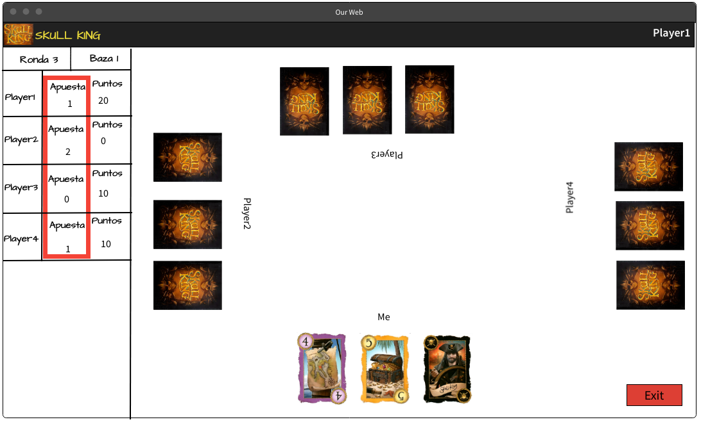|
|El jugador podrá observar las apuestas de todos los jugadores actualizada tras cada ronda en el margen izquierdo de la pantalla. Esta se mantendrá visible durante toda la ronda hasta que se actualice en la siguiente ronda.|

 ### HJJ6-(ISSUE#41): Elegir rol de la carta Tigresa ([https://github.com/gii-is-DP1/DP1-2024-2025--l7-5/issues/41]())
| "Como jugador quiero poder escoger el rol de la carta Tigresa (bandera blanca o pirata) para poder cumplir con mi apuesta."| 
|-----|
|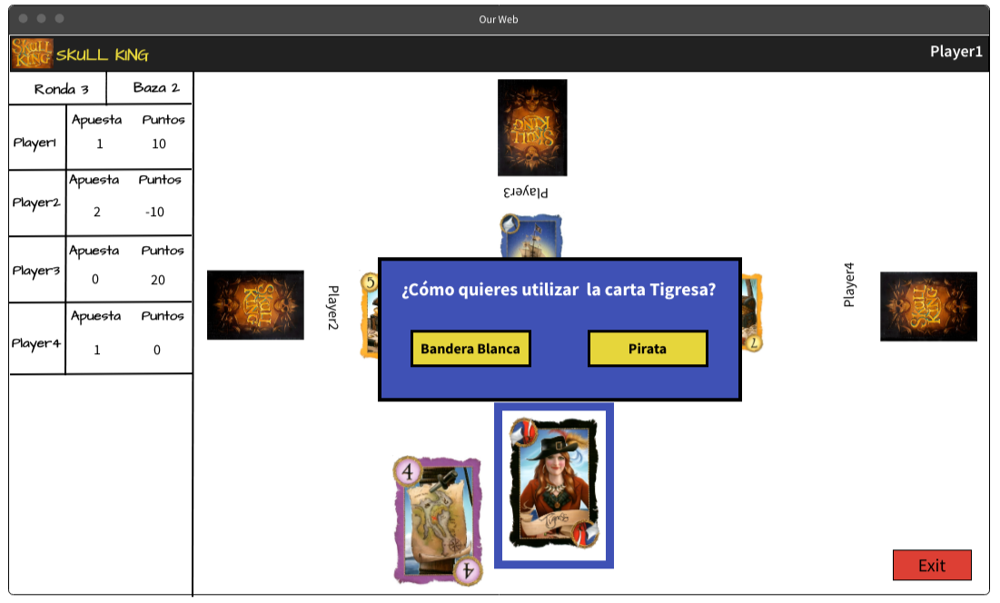|
|El jugador selecciona la carta Tigresa, aparece una ventana emergente donde le aparecerán dos botones con cada una de las opciones, deberá pulsar una de los dos para elegir el rol. Una vez pulsado el rol quedará seleccionado.|

 ### HJJ7-(ISSUE#42): Salir de la partida ([https://github.com/gii-is-DP1/DP1-2024-2025--l7-5/issues/42]())
| "Como jugador quiero poder rendirme y salir en mitad de la partida para evitar seguir jugando en caso de que me surja un imprevisto."| 
|-----|
|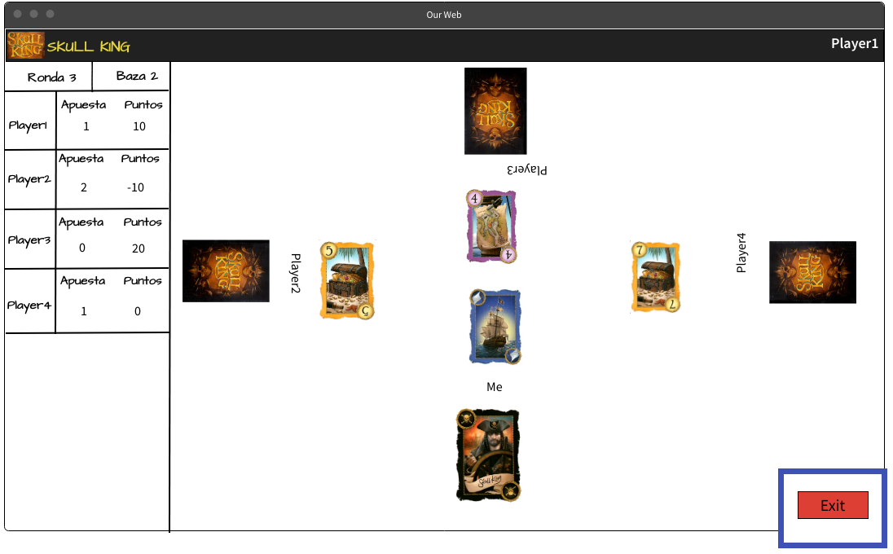|
|El jugador debe pulsar el botón 'Exit', situado en la esquina inferior derecha.|

### HJJ8-(ISSUE#47): Conocer reglas de juego ([https://github.com/gii-is-DP1/DP1-2024-2025--l7-5/issues/47#issue-2565864686]())
| "Como Jugador quiero conocer las reglas del juego para poder jugar correctamente."| 
|-----|
|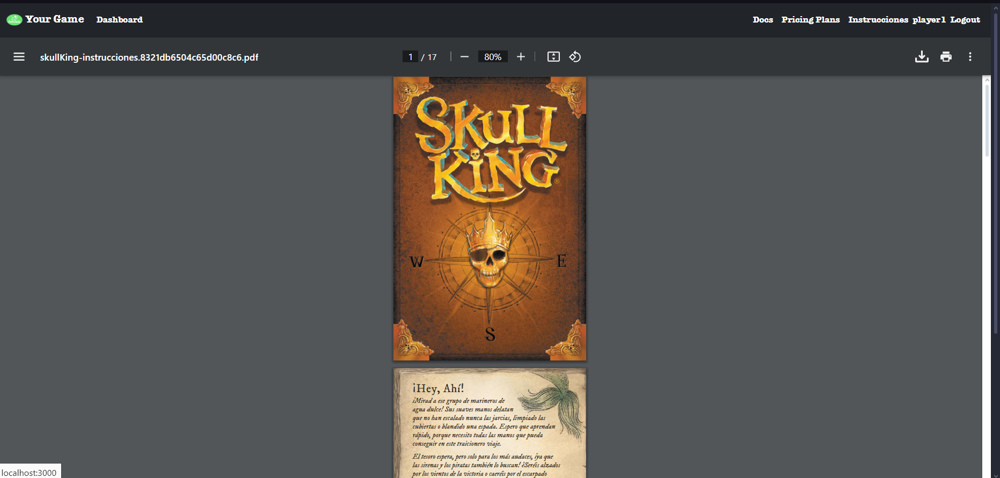|
|Puedes acceder al pdf con todas las reglas del juego e incluso descargar dicho pdf para tenerlo en tu computadora.|

 ### HJJ9-(ISSUE#48): Crear partidas ([https://github.com/gii-is-DP1/DP1-2024-2025--l7-5/issues/48#issue-2565866251]())
| "Como jugador quiero poder crear partidas para poder jugar."| 
|-----|
|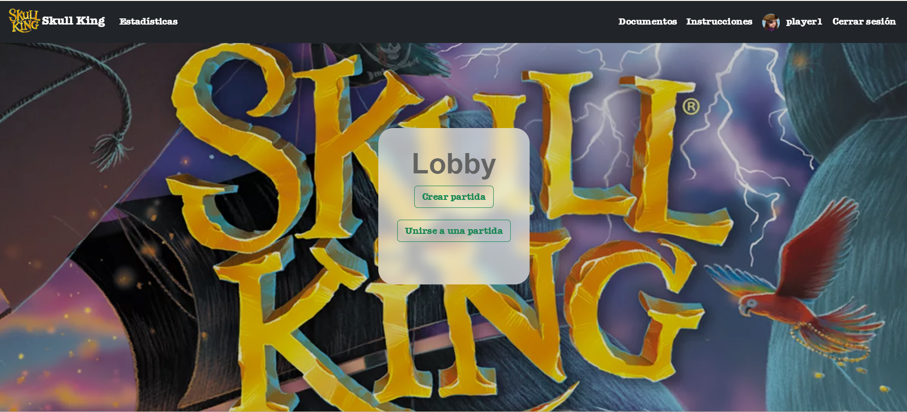|
|Puedes presionar en el botón "crear partida", para crear una sala en la que las personas puedan entrar.|

 ### HJJ10-(ISSUE#43): Hacer apuestas ([https://github.com/gii-is-DP1/DP1-2024-2025--l7-5/issues/43]())
| "Como jugador quiero poder hacer apuestas sobre cuántas bazas ganaré para poder planificar mi estrategia."| 
|-----|
|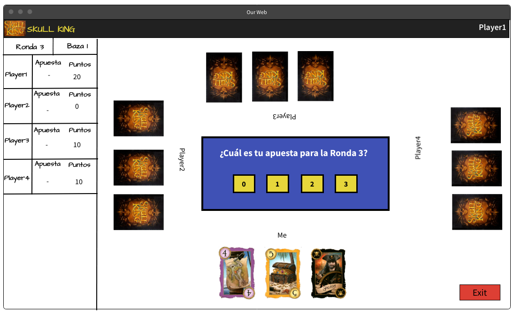|
|Al inicio de cada ronda aparecerá una ventana emergente con botones del 0 al número de cartas repartidas en la ronda actual, el jugador deberá pulsar uno de los números en función de la predicción de bazas que cree que va a ganar en la ronda.|

 ### HJA1-(ISSUE#44): Ver listado de partidas en curso ([https://github.com/gii-is-DP1/DP1-2024-2025--l7-5/issues/44]())
| "Como administrador quiero poder ver el listado de partidas en curso, incluyendo creador y usuarios participantes para llevar un control sobre las partidas en curso."| 
|-----|
|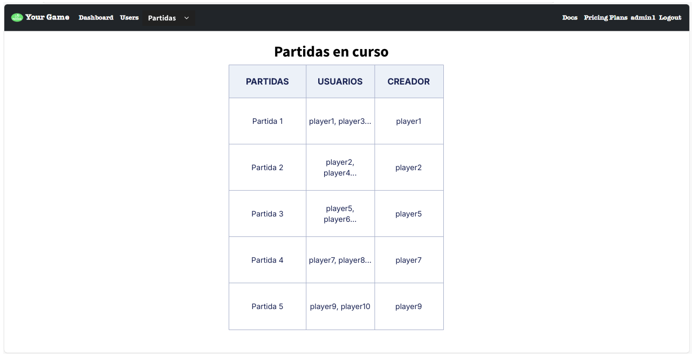|
|El administrador, en la parte superior de la pantalla, tendrá un desplegable 'Partidas' del que salen las categorías 'En Curso' y 'Terminadas'. Debe pulsar en 'En Curso', esto le llevará a una pantalla con el listado de partidas en curso.|

### HJA2-(ISSUE#45): Ver listado de partidas finalizadas ([https://github.com/gii-is-DP1/DP1-2024-2025--l7-5/issues/45]())
| "Como administrador quiero poder ver el listado de partidas finalizadas, incluyendo creador y usuarios participantes para llevar un control sobre las partidas ya finalizadas."| 
|-----|
|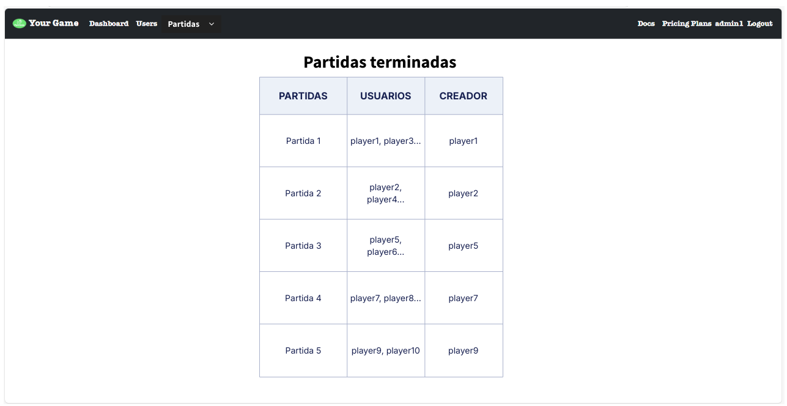|
|El administrador, en la parte superior de la pantalla, tendrá un desplegable 'Partidas' del que salen las categorías 'En Curso' y 'Terminadas'. Debe pulsar en 'Terminadas', esto le llevará a una pantalla con el listado de partidas ya finalizadas.|

 ### HGJ1-(ISSUE#49): Registrar usuarios ([https://github.com/gii-is-DP1/DP1-2024-2025--l7-5/issues/49#issue-2565870591]())
| "Como jugador quiero poder registrarme en el juego para poder jugar al mismo."| 
|-----|
|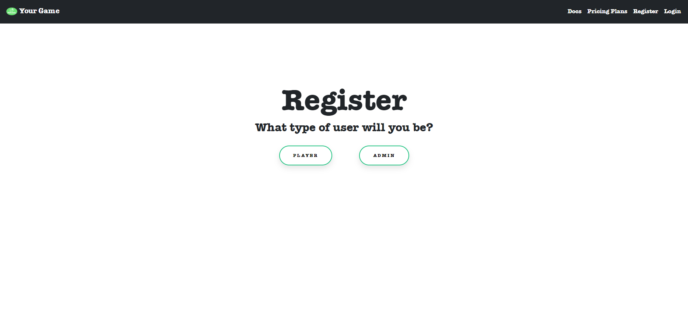|
|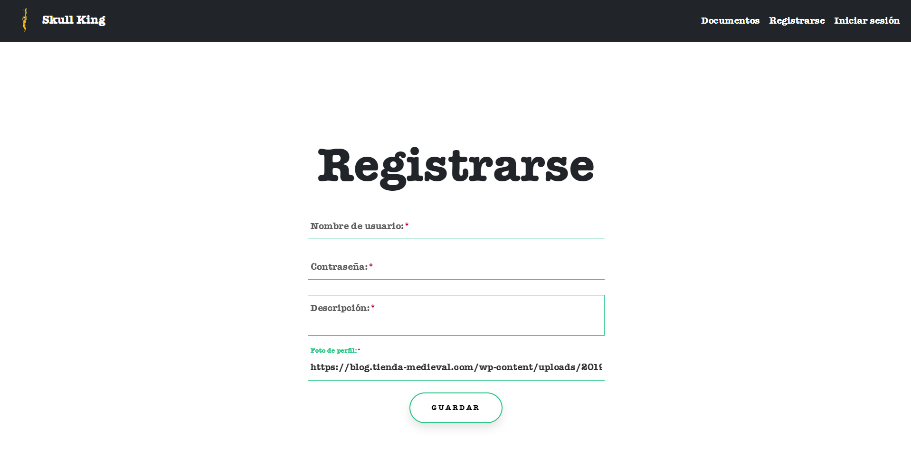|
|Puedes presionar el boton "player" para registrate como jugador, esto te enviará a un formulario en el cual simplemente debes introducir los datos indicados y presionar "save" para guardar tu perfil.|

 ### HGJ2-(ISSUE#50): Hacer log-in ([https://github.com/gii-is-DP1/DP1-2024-2025--l7-5/issues/50#issue-2565890369]())
| "Como jugador quiero poder loguearme en el juego para jugar desde mi usuario."| 
|-----|
||
|Tienes que rellenar los datos solicitados para verificar que efectivamente es tu usuario, finalmente puedes presionar "Log-in", en el cual si los datos son correctos entrarás en tu perfil, en caso contrario deberás introducirlos nuevamente.|

 ### HGJ3-(ISSUE#51): Hacer log-out ([https://github.com/gii-is-DP1/DP1-2024-2025--l7-5/issues/51#issue-2565892501]())
| "Como jugador quiero poder hacer log-out para salirme de mi usuario y evitar que otras personas lo usen"| 
|-----|
|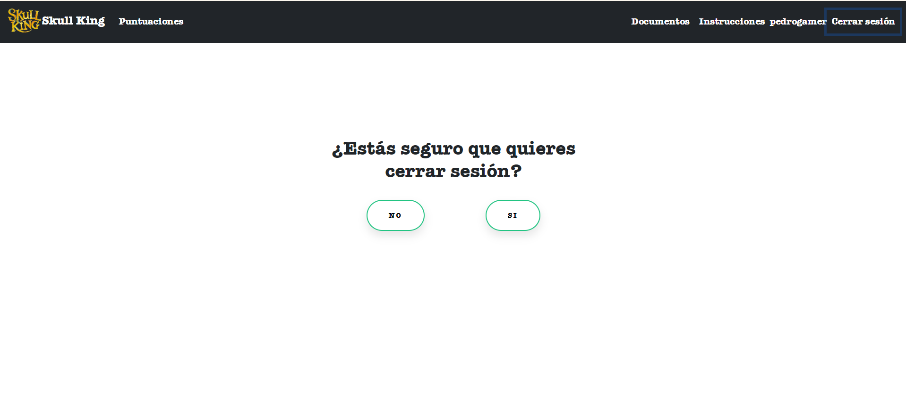|
|Siempre y cuando estés logado, aparecerá en el navbar el botón "log-out", una vez presionado ya no estarás logado en tu perfil.|

 ### HGJ4-(ISSUE#52): Editar perfil de usuario  ([https://github.com/gii-is-DP1/DP1-2024-2025--l7-5/issues/52#issue-2565901340]())
| "Como jugador quiero poder editar mi perfil para poner mi información correctamente."| 
|-----|
|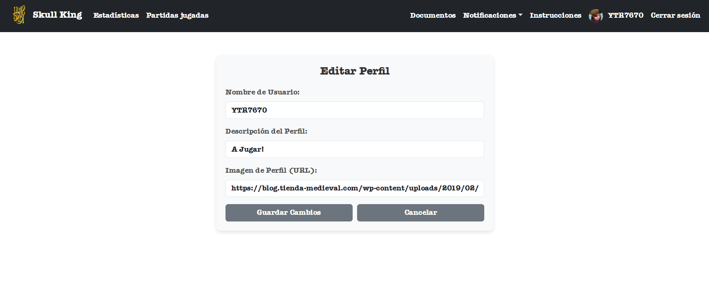|
|  |

 ### HGA1-(ISSUE#30): Listado usuaios registrados ([https://github.com/gii-is-DP1/DP1-2024-2025--l7-5/issues/30#issue-2561421045]())
| "Como admin quiero ver el listado de usuarios registrados para llevar un control sobre la cantidad de usuarios en el sistema."| 
|-----|
|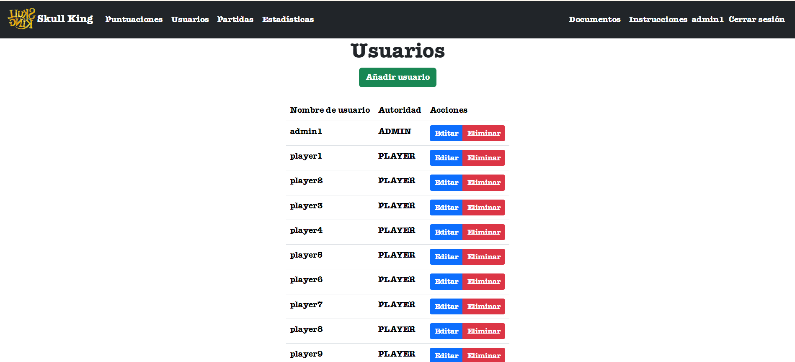|
|Se despliega una lista de todos los usuarios registrados en el sistema.|

 ### HGA4-(ISSUE#53): CRUD de usuarios ([https://github.com/gii-is-DP1/DP1-2024-2025--l7-5/issues/53#issue-2565933479]())
| "Como administrador quiero poder crear, ver, actualizar y borrar usuarios para llevar un control adecuado de los usuarios del sistema."|
|-----|
||
|En la lista de usuarios tienes las opciones para editar los datos de los usuarios usando el boton "edit", crear uno con el boton "add user" y eliminarlo usando "delete", ademas haciendo click en el nombre del usuario puedes ver su perfil.|

 ### HGA5-(ISSUE#54): Restablecer ([https://github.com/gii-is-DP1/DP1-2024-2025--l7-5/issues/54#issue-2565956464]())
| "Como administrador quiero poder restablecer la contraseña de un usuario para ayudar a los jugadores que hayan olvidado sus credenciales."|
|-----|
|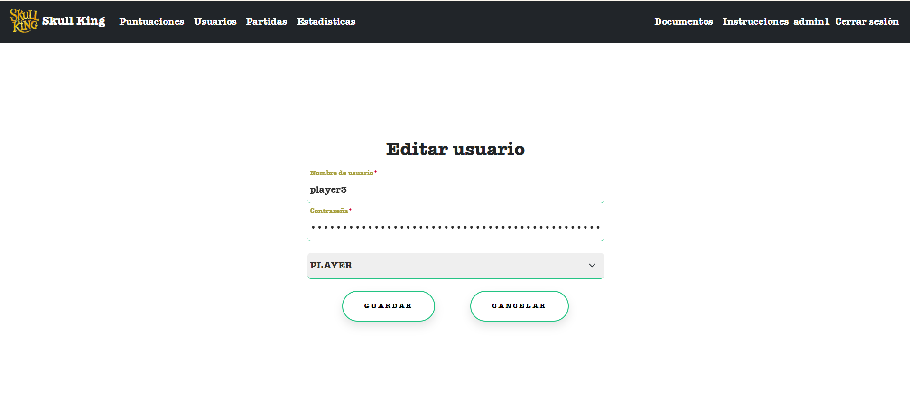|
|En el formulario que aparece puedes modificar los datos en el apartado de contraseña para cambiar las credenciales del usuario especificado.|

## Diagrama conceptual del sistema
En esta sección proporcionamos un diagrama UML de clases que describe el modelo de datos a implementar en la aplicación. Este diagrama esta anotado con las restricciones simples de los datos a gestionar por la aplicación.

## Reglas de Negocio
### R0 - Cartas en la baraja 
Las cartas que conforman las manos de una ronda concreta no se pueden repetir.

### R1 - Bazas de vuelta a la baraja  
Al finalizar cada baza, esta permanecerá en la mesa del jugador ganador. Una vez finalizada la ronda, todas las bazas vuelven a la baraja.

### R2 - Jugadores en partida  
Previo al comienzo de la partida se deberá tener como mínimo 3 jugadores. Al cumplir con esta condición se podrá dar inicio al juego. A su vez, será necesario comprobar que no se supere la cantidad de 8 jugadores.

### R3 - Número de cartas en cada ronda normal  
El número de cartas a repartir estará determinado por el número de ronda en la que se encuentre la partida, siendo la última la ronda 10.  
Existe un caso especial en las partidas de más de 6 jugadores. En este caso, la partida alcanzará un punto en el que no se podrán repartir el mismo número de cartas que de ronda. Por ello, se repartirán el máximo de cartas posibles a cada jugador, siendo estas la misma cantidad.

### R4 - Realizar apuesta  
Al comenzar cada ronda, posterior al reparto de cartas, en función de tu mano se deberá hacer una apuesta.

### R5 - Apuesta válida  
La apuesta de cada jugador deberá ser menor o igual al número de cartas en mano y mayor o igual a 0.

### R6 - Obtención de puntos  
La única forma de obtener puntos en el juego es acertar la apuesta realizada a inicios de la ronda.

### R7 - Obtención de puntos de bonificación  
Para obtener puntos de bonificación se deberá acertar la apuesta realizada a inicios de ronda.

### R8 - Palo de la baza  
La definición del palo de la ronda vendrá determinada por la carta tirada en primer lugar.

### R9 - Palo de la baza: bandera blanca  
La definición del palo de la ronda vendrá determinada por la carta tirada tras la bandera blanca. En caso de que se emplee esta carta nuevamente, el palo será definido por el siguiente jugador.

### R10 - Palo de la baza: carta personaje  
En caso de que el primer jugador juegue una carta de personaje, la baza no tendrá un palo principal.

### R11 - Palo principal  
El jugador deberá jugar una carta del palo principal, en caso de no tener, se tirará cualquier carta de su elección.

### R12 - Cartas especiales  
Si el jugador posee alguna carta especial, este podrá jugarla independientemente del palo principal.

### R13 - Carta de huida  
Al jugar una carta de huida se perderá la baza en la que se juegue, a menos que todas las cartas jugadas en la misma baza sean de huida o Tigresa como un huida, pues la primera carta jugada ganará la baza.

### R14 - Carta de personajes  
Si se quiere jugar la carta Tigresa, una vez puesta en mesa, se deberá elegir el tipo de papel que interpretará, bandera blanca o pirata.

### R15 - Definición del primer jugador  
Al iniciar la partida se elegirá de forma aleatoria al jugador que comenzará la baza de la primera ronda. En cada baza nueva, el jugador que comenzará será el siguiente al que comenzó en la baza anterior, siguiendo el sentido horario.

### R16 - Turnos  
El turno de cada jugador vendrá determinado por el sentido horario.

### R17 - Ganador de baza  
El ganador de la baza será aquel cuyo truco sea el más alto, respetando la jerarquía.

### R18 - Ganador de la partida  
El ganador de la partida será aquel cuya puntaje sea el mayor en comparación con el resto de jugadores.

### R19 - Finalización de ronda  
La ronda finaliza una vez se jueguen las bazas de dicha ronda.

### R20 - Finalización de partida  
La partida finaliza una vez se haya calculado la puntuación final.

### R21 - Cálculo de puntos de ronda  
El cálculo de los puntos de la ronda se realizará al finalizar esta.

### R22 - Relación jugador - usuario  
Cada usuario tendrá asociado un jugador al entrar en partida. El jugador no debe ser necesariamente el mismo al de una partida anterior, pueden ser distintos.

### R23 - Usuario con varios jugadores  
El usuario en la aplicación, a medida que juegue partidas podrá tener distintos jugadores, sin embargo, nunca podrán haber dos jugadores del mismo usuario jugando al mismo tiempo.

### R24 - 3 Cartas de personajes distintas  
En el caso de que en mesa se hayan jugado las 3 cartas de personaje (Skull King, Pirata y Sirena), la primera sirena jugada ganará la ronda.

### R25 - Todas las cartas banderas blancas  
En el caso de que en mesa todos los jugadores hayan jugado bandera blanca (también puede ser la tigresa jugada como bandera blanca), ganará el truco tirada en primer lugar.

### R26 - Relación Skull King - Pirata  
En el caso de que en mesa se haya jugado un Skull King y uno o varios piratas, ganará el Skull King.

### R27 - Relación Pirata - Sirena  
En el caso de que en mesa se hayan jugado uno o varios piratas y una o varias sirenas, ganará el primer pirata jugado.

### R28 - Cartas triunfo  
En el caso de que no se haya jugado ninguna carta de personaje y haya en mesa uno o más triunfos, ganará el de mayor número.

### R29 - Cartas del palo principal  
En el caso de que no se haya jugado ninguna carta de personaje ni triunfo, ganará el truco de mayor número del palo principal.

### R30 - Apostar a ganar: acierto de apuesta  
Si el jugador establece que ganará al menos 1 baza, y acierta la apuesta, el número de bazas ganadas se multiplicará por 20 puntos.

### R31 - Apostar a ganar: apuesta no acertada  
Si el jugador establece que ganará al menos 1 baza, y no acierta la apuesta, el número de bazas apostadas a ganar y no se han ganado se multiplicará por -10 puntos.

### R32 - Apostar a perder: acierto de apuesta  
Si el jugador establece que perderá todas las bazas de la ronda, y acierta la apuesta, el número de bazas de la ronda se multiplicará por 10 puntos.

### R33 - Apostar a perder: apuesta no acertada  
Si el jugador establece que perderá todas las bazas de la ronda, y no acierta la apuesta, el número de bazas de la ronda se multiplicará por -10 puntos.

### R34 - Puntos de bonificación: carta 14 de palo  
Una vez se compruebe que se ha acertado la apuesta, si el jugador ha ganado alguna baza que incluya alguna carta 14 de los palos normales, se sumarán 10 puntos por cada una a su puntuación de la ronda.

### R35 - Puntos de bonificación: carta 14 de triunfo  
Una vez se compruebe que se ha acertado la apuesta, si el jugador ha ganado alguna baza que incluya alguna carta 14 de triunfo, se sumarán 20 puntos a su puntuación de la ronda.

### R36 - Puntos de bonificación: sirena capturada  
Una vez se compruebe que se ha acertado la apuesta, si el jugador ha ganado alguna baza que incluya alguna carta de sirena, se sumarán 20 puntos por cada una a su puntuación de la ronda.

### R37 - Puntos de bonificación: pirata capturado  
Una vez se compruebe que se ha acertado la apuesta, si el jugador ha ganado alguna baza que incluya alguna carta de pirata, se sumarán 20 puntos por cada uno a su puntuación de la ronda.

### R38 - Puntos de bonificación: Skull King capturado  
Una vez se compruebe que se ha acertado la apuesta, si el jugador ha ganado alguna baza que incluya la carta de Skull King, se sumarán 40 puntos a su puntuación de la ronda.

### R39 - Puntos de bonificación: 3 cartas de personaje distintos  
Una vez se compruebe que se ha acertado la apuesta, si el jugador ha ganado alguna baza que incluya los 3 tipos de personaje, se aplicará la regla de puntos de bonificación de Skull King capturado.

