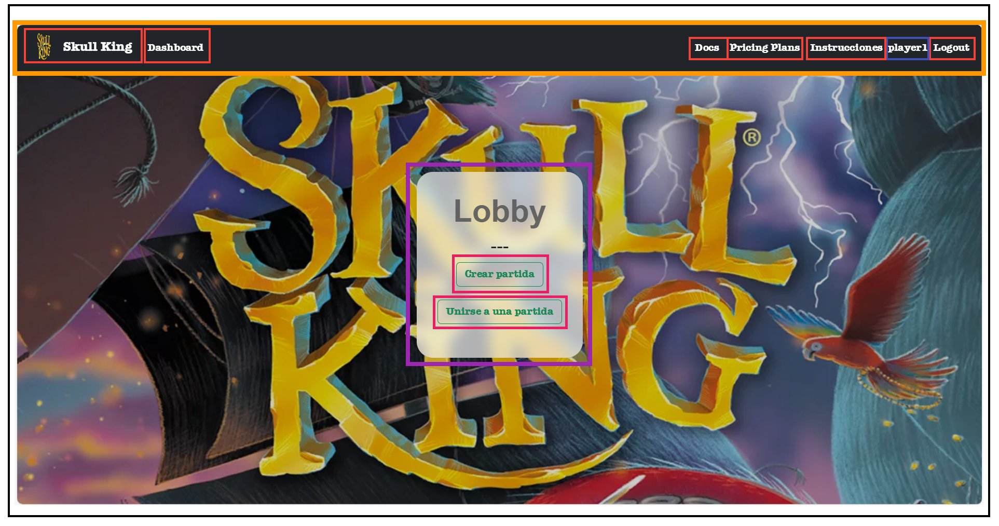

# Documento de diseño del sistema

## Introducción

Este proyecto pretende ofrecer la posibilidad de jugar de forma online al juego de mesa Skull King, juego de cartas con temática pirata en el cual deberás apostar el número exacto de bazas que crees que ganarás en cada ronda. El programa permite a la persona interesada crear un usuario con el que será capaz de contactar con otros jugadores e iniciar una partida. 

Esta adaptación tiene como límite 10 jugadores en partida. Además, no se podrá comenzar una partida a menos que haya 3 usuarios en esta.

### EXPLICACIÓN DEL JUEGO:

En el comienzo de la partida se realiza el primer reparto de cartas. El número de cartas vendrá determinado por la ronda en la que se encuentre la partida, por ejemplo: ronda 3, se reparten 3 cartas, una por cada baza. Existe una excepción en las partidas de más de 8 jugadores, pues en alguna ronda no se podrá aplicar la regla anterior ya que no hay suficientes cartas. Por ello, se repartirá el máximo de cartas posibles a cada jugador, siendo estas la misma cantidad.

Cada jugador jugará su carta, y siguiendo la jerarquía se determinará el ganador de cada baza. Una vez jugadas las bazas que forman la ronda, se realizará el cálculo de puntos, incluyendo los puntos de bonificación.

Finalmente, el ganador se definirá a partir de la suma de las puntuaciones de las 10 rondas que conforman la partida, la cual tiene una duración media de 30 minutos. 

### JERARQUÍA DE CARTAS:

En la cúspide de la jerarquía se encuentran las cartas de personaje: pirata, sirena y Skull King. Estos mantienen una relación parecida al juego “piedra, papel y tijera”; el pirata gana a la sirena, el Skull King al pirata y la sirena al Skull King. Además, debemos tener en cuenta la carta tigresa, pues puede ejercer dos papeles, pirata o bandera blanca. 

Siguiendo la jerarquía, hallamos el palo de triunfos con cartas numeradas del 1 al 14. Por debajo, se sitúan el resto de palos, morado, amarillo y verde, numerados de la misma forma. Finalmente, se encuentran las banderas blancas, las cuales pierden la baza independientemente del resto de cartas jugadas.

### CARTAS:

#### Bandera Blanca


 Las 5 cartas de bandera blanca pueden ser jugadas para ‘no ganar’ al considerarse de valor 0. Pierden con el resto de cartas. Son muy útiles para aseguraros no ganar más bazas de las que se han pujado.

#### Pirata


Las cartas de Pirata superan a todas las cartas numeradas. Todas son de igual valor, por lo que si se juegan más de una en la misma baza, quien haya jugado el primer pirata ganará la baza.

#### Tigresa


Al jugar la Tigresa, debéis declarar si contará como Pirata o como Huida. Asume todas la características de un pirata o de una huida.

#### Skull King


El Skull King vence a todas las cartas numeradas y todos los Piratas (incluida la Tigresa al ser jugada como Pirata). Las únicas que puede derrotarle son las Sirenas.

#### Sirena


Las Sirenas vencen a todos los palos numerados pero pierden con todos los Piratas,con la excepción del Skull King. Si se juegan ambas Sirenas en la misma baza, la primera que fue jugada ganará la baza.

#### Palos normales (amarillo, verde y morado)


Hay tres palos normales: amarillo (Cofre del Tesoro), verde (Loro) y morado (Mapa del Tesoro).

#### Palo Triunfo


Las cartas triunfo son superiores a la de las otras tres palos.

### PUNTUACIÓN:

A la hora de apostar se decide cómo se ganarán puntos. Por un lado, se puede apostar todo a perder, el jugador deberá perder todas las bazas. En el caso de acertar su apuesta se multiplicará por 10 el número de cartas de la ronda, y si se equivoca, se multiplicará por -10 el número anterior. Por otro lado, se puede realizar una apuesta normal en la cual las bazas ganadas se multiplicarán por 20 si se acierta la apuesta, en caso de que esta sea errónea, se multiplicará por -10 aquellas bazas no acertadas.

Una vez realizado dicho cálculo de puntos se sumarán los puntos de bonificación si y sólo si se ha acertado la apuesta. Para ello, se deberá analizar las bazas ganadas de cada jugador. 

Si se halla alguna carta 14 de los palos normales, se deberá sumar 10 puntos por cada una, y en el caso de encontrar el 14 del palo de triunfos, se sumarán 20 puntos. Para calcular los puntos que se obtienen con las cartas de personaje se deberá tener en cuenta las relaciones: 20 puntos por cada sirena ganada por el pirata, 30 puntos por cada pirata ganado por el Skull King, y 40 puntos si la sirena ha ganado al Skull King.

[Enlace al vídeo de explicación de las reglas del juego / partida jugada por el grupo](https://youtu.be/CV1VBWZAIJM)

## Diagrama(s) UML:

### Diagrama de Dominio/Diseño


En este diagrama de capas podemos ver las relaciones entre las distintas entidades. Como podemos observar hemos realizado todas las relaciones con unidireccionalidad de forma que se han implementado clases que funcionan como clases intermedias, ahorrandonos asociaciones many-to-many. Se ha obviado comentar el tipo de la entidad en la clase, pues todas las entidades implementan "BaseEntity".

Las entidades implicadas son: Partida, Ronda, Baza, Mano, Truco, Carta, Jugador y Usuario.

### Diagrama de Capas (incluyendo Controladores, Servicios y Repositorios)


En este diagrama de capas podemos ver las relaciones entre los controladores de cada entidad y los distintos servicios, además de las conexiones con los repositorios.

Las entidades implicadas son: Partida, Ronda, Baza, Mano, Truco, Carta, Jugador y Usuario.

## Descomposición del mockups del tablero de juego en componentes

En esta sección procesaremos el mockup del tablero de juego (o los mockups si el tablero cambia en las distintas fases del juego). Etiquetaremos las zonas de cada una de las pantallas para identificar componentes a implementar. Para cada mockup se especificará el árbol de jerarquía de componentes, así como, para cada componente el estado que necesita mantener, las llamadas a la API que debe realizar y los parámetros de configuración global que consideramos que necesita usar cada componente concreto. 

**Descomposición en componentes de la interfaz de creación y unión a partidas**



  - App – Componente principal de la aplicación
    - $\color{#ff9800}{\textsf{NavBar – Barra de navegación superior}}$
      - $\color{#f44336}{\textsf{[ NavButton ]. Muestra un botón de navegación con un icono asociado.}}$
    - $\color{#3f51b5}{\textsf{UserIdentificationArea – Área de identificación del usuario actual}}$
    - $\color{#9c27b0}{\textsf{PlayUnionBar – En este componente se muestran los botones para crear o unirse a una partida}}$
      - $\color{#e91e63}{\textsf{[ NavButton ] – Muestra un botón de navegación a los distintos modales con un texto asociado. }}$

## Documentación de las APIs
Se considerará parte del documento de diseño del sistema la documentación generada para las APIs, que debe incluir como mínimo, una descripción general de las distintas APIs/tags  proporcionadas. Una descripción de los distintos endpoints y operaciones soportadas. Y la especificación de las políticas de seguridad especificadas para cada endpoint y operación. Por ejemplo: “la operación POST sobre el endpoint /api/v1/game, debe realizarse por parte de un usuario autenticado como Player”.

Si lo desea puede aplicar la aproximación descrita en https://vmaks.github.io/2020/02/09/how-to-export-swagger-specification-as-html-or-word-document/ para generar una versión en formato Word de la especificación de la API generada por OpenAPI, colgarla en el propio repositorio y enlazarla en esta sección del documento.  En caso contrario debe asegurarse de que la interfaz de la documentación open-api de su aplicación está accesible, funciona correctamente, y está especificada conforme a las directrices descritas arriba.

## Patrones de diseño y arquitectónicos aplicados
En esta sección de especificar el conjunto de patrones de diseño y arquitectónicos aplicados durante el proyecto.

### Patrón: Modelo Vista Controlador (MVC)
*Tipo*: Arquitectónico

*Contexto de Aplicación*

Se utiliza en toda la aplicación, separa los datos de la aplicación, la interfaz de usuario y la lógica de negocio en 3 componentes.

Modelo: Representación específica de la información con la que se opera, incluye los datos y la lógica para operar con ellos. Dentro del modelo se incluyen: entidades, repositorios y servicios.

Controlador: Responde a eventos de la interfaz de usuario e invoca cambios en el modelo y probablemente en la vista (intermediario entre vista y modelo).

Vista: Presentación del modelo de forma adecuada para interactuar con ella, representando la información proporcionada por el controlador.

*Clases o paquetes creados*

Respecto a los paquetes, cada entidad tiene su paquete. En ellos se encuentra la entidad y sus respectivos repository, service y rest controller.

Respecto a las vistas, por el momento, se han creado los paquetes play, salaEspera y player. En ellos se encuentran, respectivamente, el manejo de creación y unión a partidas, la sala de espera donde se van uniendo los jugadores, y las instrucciones.

*Ventajas alcanzadas al aplicar el patrón*

Ofrece soporte para múltiples vistas, favorece la alta cohesión, el bajo acoplamiento y la separación de responsabilidades. Facilita el desarrollo y las pruebas de cada tipo de componente.

### Patrón: Arquitectura centrada en datos
*Tipo*: Diseño

*Contexto de Aplicación*

Se ha implementado una base de datos donde se encuentrán almacenadors datos de uusarios y todas las cartas del juego. Aquí también se puden almacenar datos de todas las entidades para probar las distintas excepciones de manera rápida.

*Clases o paquetes creados*

En el repositorio del proyecto inicialmente venía incluida una clase data.sql.

*Ventajas alcanzadas al aplicar el patrón*

La principal ventaja es la posibilidad de o¡introducir todas las cartas directamente en base de datos, evitando así tener que crearlas una a una cada vez que se inicia una partida.

### Patrón: Dependency Injection
*Tipo*: Diseño

*Contexto de Aplicación*

Se utiliza el patrón de Inyección de Dependencias para gestionar las dependencias entre componentes de manera flexible. Este patrón facilita la creación de sistemas modulares y mantenibles al desacoplar los objetos y permitir la configuración externa de sus dependencias.

*Clases o paquetes creados*

Las clases mencionadas en el patrón MVC. Normalmente los servicios son las clases que se inyectan en los controladores, y los repositorios se inyectan en los servicios.

*Ventajas alcanzadas al aplicar el patrón*

Nos aseguramos de que se cree solo una instancia de estas clases y que todas las clases que la necesiten puedan acceder a ella. Hacer esto sin un contenedor de inversión de control (Spring en este caso) resulta complicado. Permitimos que el framework realice operaciones complejas facilitando y ayudando mucho al programador en numerosas clases.

### Patrón: Layer Super Type
*Tipo*: Arquitectónico | de Diseño

*Contexto de Aplicación*

Este patrón se utiliza para compartir comportamientos comunes y atributos entre clases en una jerarquía, generalmente situados en la capa superior de dicha jerarquía. Nos ha sido esencial la utilidad de este patrón para la codificación de la aplicación ya que varios objetos java de nuestro modelo de dominio hacen uso de este concepto.

*Clases o paquetes creados*

Se ha usado la clase BaseEntity.java.

*Ventajas alcanzadas al aplicar el patrón*

El patrón Layer Super type ofrece beneficios en el diseño de software al facilitar la reutilización de código, promover la consistencia, mejorar la mantenibilidad y proporcionar claridad en la jerarquía de clases. Además, se evita la duplicación de código y se simplifica el mantenimiento al tener un único punto de modificación para elementos compartidos.

### Patrón: State
*Tipo*: Diseño

*Contexto de Aplicación*

Se utiliza el patrón de comportamiento State para que dependiendo del estado del conjunto de cartas jugadas en una Baza, la carta ganadora de la Baza se calcule de una manera concreta. Un conjunto de cartas puede contener personajes, de los cuales alguno de ellos será el ganador de la Baza; puede incluir cartas de triunfo, siendo la ganadora aquella carta de triunfo con mayor número; o puede haber cartas de palo, en cuyo caso la carta ganadora sería la carta del mismo TipoPalo que la Baza y con mayor valor.

*Clases o paquetes creados*

Para implementar este patrón se ha creado el paquete trucoState, dentro del cual hemos incluido la clase CalculoGanadorContext, la cual actúa de contexto que es el que almacena una referencia a uno de los objetos de estado concretos y le delega todo el trabajo específico del estado. Además también hemos añadido las clases con los estados concretos, los cuales proporcionan sus propias implementaciones para los métodos específicos del estado. Los estados concretos que puede tener el método calculoGanador son: CartasPaloState, PersonajesState y TriunfosState.

*Ventajas alcanzadas al aplicar el patrón*

Conseguimos reducir el número de condiciones a comprobar en el método calculoGanador de la clase TrucoService, puesto que algunas de estas condiciones solo se realizan si el conjunto de cartas se encuentra en un estado concreto.


## Decisiones de diseño
_En esta sección describiremos las decisiones de diseño que se han tomado a lo largo del desarrollo de la aplicación que vayan más allá de la mera aplicación de patrones de diseño o arquitectónicos._

### Decisión 1: Clases regulares para implementar las clases asociaciones
#### Descripción del problema
En el diseño del sistema se detectó la necesidad de establecer relaciones entre las entidades de manera clara y controlada. Las asociaciones ManyToMany suelen generar complejidad adicional en navegabilidad y mantenimiento, por lo que se han buscado alternativas que mejoren la claridad y el control de estas relaciones a la hora de realizar la arquitectura del sistema.

#### Alternativas de solución evaluadas
1. Utilizar relaciones ManyToMany estándar:
   - *Ventajas*: Simplicidad en la definición de relaciones directas entre entidades.
   - *Inconvenientes: Complejidad en la gestión de la navegabilidad y dificultades para agregar atributos adicionales a la relación y para poder relacionar propiedades entre clases.

2. Usar clases intermedias para representar asociaciones:
   - *Ventajas*: Mayor flexibilidad al poder añadir atributos y propiedades adicionales en la clase intermedia, facilitando la navegabilidad y reduciendo el acoplamiento.
   - *Inconvenientes*: Incremento en el número de clases del modelo, lo que puede hacer más complejo el diseño inicial.

#### Justificación de la solución adoptada
Se optó por utilizar clases intermedias para representar asociaciones, evitando las relaciones ManyToMany directas y reduciendo el acoplamiento entre entidades. Esta decisión mejora la claridad en la estructura del modelo de datos y facilita la gestión de asociaciones con atributos adicionales. Estas clases intermedias jugarán un rol crucial en la representación de asociaciones, definiendo claramente cuáles serán mandatorias y cuáles opcionales.


### Decisión 2: Mandatory/Opcional en clases

#### Descripción del problema
El modelo de dominio requiere la capacidad de especificar relaciones obligatorias y opcionales entre entidades, lo que puede influir en la integridad de los datos en el sistema.

#### Alternativas de solución evaluadas
1. Definir todas las relaciones como opcionales:
   - *Ventajas*: Mayor flexibilidad.
   - *Inconvenientes*: Riesgo de inconsistencias de datos debido a relaciones no definidas.

2. Definir relaciones como obligatorias u opcionales según corresponda:
   - *Ventajas*: Mejora la integridad de los datos y garantiza que las asociaciones críticas estén siempre definidas.
   - *Inconvenientes*: Mayor complejidad en la validación y manejo de errores.

#### Justificación de la solución adoptada
Se optó por definir las relaciones como obligatorias u opcionales según las necesidades del sistema, asegurando un balance entre flexibilidad y control de los datos.


### Decisión 3: Asociaciones de mapeo unidireccionales usando peticiones HTTP

#### Descripción del problema
Las relaciones bidireccionales aumentan el acoplamiento entre entidades, lo que reduce la flexibilidad del sistema. Por lo tanto, se planteó la necesidad de simplificar estas asociaciones.

#### Alternativas de solución evaluadas
1. Uso de relaciones bidireccionales estándar**:
   - *Ventajas*: Navegabilidad directa entre entidades relacionadas.
   - *Inconvenientes*: Aumento del acoplamiento y de dependencias circulares.

2. Asociaciones unidireccionales utilizando peticiones HTTP**:
   - *Ventajas*: Mayor flexibilidad y menor acoplamiento entre componentes.
   - *Inconvenientes*: Complejidad añadida en la gestión de las peticiones HTTP.

#### Justificación de la solución adoptada
Se decidió utilizar asociaciones unidireccionales mediante peticiones HTTP para reducir el acoplamiento y aumentar la modularidad del sistema, favoreciendo la escalabilidad y el desacoplamiento a la hora de la integración de servicios y entidades.


### Decisión 4: Modelo de dominio (Datos y Comportamientos)

#### Descripción del problema
Es necesario un enfoque que combine tanto datos como comportamientos en las entidades del modelo para mejorar la cohesión del sistema y facilitar la lógica de negocio.

#### Alternativas de solución evaluadas
1. Modelo de dominio centrado solo en datos:
   - *Ventajas*: Simplicidad en la definición de entidades.
   - *Inconvenientes*: Lógica de negocio dispersa en diferentes capas.

2. Modelo de dominio que combina datos y comportamientos:
   - *Ventajas*: Mayor cohesión y encapsulación de la lógica de negocio.
   - *Inconvenientes*: Aumento de la complejidad en el diseño inicial.

#### Justificación de la solución adoptada
Se optó por un modelo de dominio que incluya tanto datos como comportamientos, promoviendo una arquitectura orientada a objetos más robusta y coherente.


### Decisión 5: Implementación de capa de servicio usando Data Mapper

#### Descripción del problema
Era necesario implementar una capa de servicio para gestionar operaciones, transacciones, llamadas a sistemas externos y coordinación de entidades de dominio, evitando acoplamientos directos con el modelo de dominio.

#### Alternativas de solución evaluadas
1. Uso directo del modelo de dominio en controladores:
   - *Ventajas: Menor complejidad inicial.
   - *Inconvenientes: Aumento del acoplamiento y dificultades en la escalabilidad.

2. Implementación de capa de servicio con Data Mapper:
   - *Ventajas*: Mejora la independencia de las bases de datos y reduce el acoplamiento.
   - *Inconvenientes*: Complejidad adicional en la implementación.

#### Justificación de la solución adoptada
Se decidió implementar una capa de servicio utilizando el patrón Data Mapper para lograr una mejor separación entre el modelo de dominio y la capa de mapeador.


### Decisión 6: Implementación de herencia completa y disjunta
#### Descripción del problema
El sistema necesita una estrategia de herencia que permita extender entidades base de forma clara y sin ambigüedades asegurando que cada entidad especializada tenga un propósito claro y no se solapen las responsabilidades entre subclases.

#### Alternativas de solución evaluadas
1. Herencia solapada e incompleta:
   - *Ventajas*: Diseño más simple.
   - *Inconvenientes*: Menor flexibilidad y posible repetición de código.

2. Herencia solapada y completa:
   - *Ventajas*: Mayor reutilización.
   - *Inconvenientes*: Riesgo de ambigüedades y complejidad en consultas.

3. Herencia completa y disjunta:
   - *Ventajas*: Claridad en la especialización y facilidad en el mantenimiento.
   - *Inconvenientes*: Mayor esfuerzo de análisis y diseño inicial.

#### Justificación de la solución adoptada
Se adoptó una herencia completa y disjunta, asegurando que cada entidad pertenezca a un único subtipo, mejorando la claridad y gestión de los modelos específicos. Esta decisión reduce ambigüedades dando un enfoque más claro en la implementación de reglas de negocio y consultas.


### Decisión 7: Uso de BaseEntity en lugar de NamedEntity

#### Descripción del problema
Buscábamos implementar una clase Entity para facilitar la implementación del identificador, por lo tanto nos decantamos en un principio por usar de entre ellas la clase “NamedEntity”, la cuál limitaba la flexibilidad al requerir nombres para todas las entidades de 3 a 50 letras. Se buscaba una alternativa más versátil.

#### Justificación de la solución adoptada
Se decidió extender todas las entidades de “BaseEntity” en lugar de “NamedEntity” para mejorar la flexibilidad en la gestión de identificadores y atributos opcionales, pues de igual forma podemos utilizar el atributo “nombre” pero no de manera obligatoria ni restrictiva.


### Decisión 8: Reglas de negocio con excepciones controladas y validaciones

#### Descripción del problema
Necesitamos garantizar el cumplimiento de las reglas de negocio y requisitos del sistema de manera robusta.

#### Justificación de la solución adoptada
Se optó por implementarlo mediante validaciones y excepciones controladas para asegurar que los datos cumplan con las reglas de negocio, priorizando las validaciones en anotaciones y delegando a Validators lo que no pueda expresarse directamente en ellas como pueden ser reglas de negocio en las que unas propiedades dependan o limiten a otras de clases distintas.

### Decisión 9: Uso de DTO y serializadores

#### Descripción del problema
Al jugar una carta específica durante el turno de un jugador, es necesario crear un objeto Truco que registre la carta jugada, el jugador correspondiente y la mano asociada. Esto permite mantener un historial completo de todas las cartas jugadas en una baza.

#### Justificación de la solución adoptada
Se decidió implementar una clase BazaCartaManoDTO, diseñada para recoger desde el frontend los valores de los estados bazaActual, cartaJugada, manoActual y turno, y enviarlos en un JSON que combina propiedades de varios objetos.
En el backend, el método jugarTruco del servicio TrucoService recibe como parámetro un objeto BazaCartaManoDTO y lo utiliza para crear un nuevo Truco. Esta solución ofrece varias ventajas:
   - Eficiencia: Simplifica la transferencia de datos al consolidar múltiples propiedades en una sola estructura.
   - Seguridad: Encapsula la lógica de serialización, reduciendo la exposición innecesaria de datos sensibles.
   - Bajo acoplamiento: Facilita la separación entre frontend y backend, mejorando la mantenibilidad del código.

### Decisión 10: Contenido visualizado a español

#### Descripción del problema
Parte del texto que se mostraba por pantalla estaba en español y otra en inglés, lo que generaba confusión en la información presentada.

#### Justificación de la solución adoptada
Se determinó que todo el contenido estuviera a español, por lo que se procedió a su traducción. De esta manera, se presenta un texto más coherente y cohesionado

## Refactorizaciones aplicadas

Refactorizaciones aplicadas en el código:

### Refactorización 1:
En esta refactorización llevamos a cabo la eliminación de números mágicos. En CartaService y ManoService se han definido las constantes ID_TIGRESA_BANDERA_BLANCA e ID_TIGRESA_PIRATA para identificar las dos posibles cartas en las que puede transformarse la carta tigresa. En JugadorService se ha creado la constante MAX_JUGADORES, que define el número máximo de jugadores permitidos en una partida. En RondaService, se añadió la constante ULTIMA_RONDA, que representa el número correspondiente a la última ronda del juego.

#### Problema que nos hizo realizar la refactorización
Había números cuyo significado no estaba claro, lo que dificultaba la legibilidad del código, ya que no se sabía qué representaban esos valores.

#### Ventajas que presenta la nueva versión del código respecto de la versión original
Ahora, esos valores sin contexto se han convertido en constantes, cuyo nombre indica lo que representan. Además, nos permite utilizar el mismo número en diferentes partes de una misma clase, puesto que ahora solo es necesario hacer referencia a la constante correspondiente.

### Refactorización 2:
En esta refactorización se ha realizado la eliminación de código innecesario. Se ha subsanado el antipatrón Boat Anchor. Se eliminó la propiedad turno de la clase Jugador, la propiedad bazaActual de la entidad Ronda, un constructor de la entidad Truco que estaba en desuso y código del proyecto base que se nos proporcionó del React-PetClinic.

#### Problema que nos hizo realizar la refactorización
Había código que no solo los desarrolladores no sabían para qué servía, sino que ni siquiera se utilizaba, lo que generaba dudas e incertidumbre entre los programadores, quienes no se decantaban por eliminarlo. Además 

#### Ventajas que presenta la nueva versión del código respecto de la versión original
Estos cambios optimizan el código al eliminar elementos redundantes o sin utilidad, mejorando su claridad y mantenibilidad.

### Refactorización 3:
En esta refactorización se ha llevado a cabo la operación de refactorización de Inline Function, en la cual se han homogeneizado las funciones findManoByJugador y findLastManoByJugador.

#### Problema que nos hizo realizar la refactorización
Se duplicaba el código en dos funciones distintas, aunque ambas realizaban la misma operación. Esto provocó que cada uno de los métodos se llamara en varias partes del proyecto, obteniendo el mismo resultado a pesar de que, supuestamente, se usaban servicios diferentes.

#### Ventajas que presenta la nueva versión del código respecto de la versión original
Evade la confusión por cuando usar cada uno de los dos métodos, ya que ambos realizan los mismo. Al eliminar código duplicado, evitamos redundancias.

### Refactorización 4:
Se ha llevado a cabo la refactorización move method, trasladando varios métodos desde el servicio correspondiente a la entidad de origen hacia el servicio de la entidad donde son utilizados con mayor frecuencia.

#### Problema que nos hizo realizar la refactorización
Al invocar desde un servicio específico métodos pertenecientes a otros servicios, se generaba una dependencia circular que impedía la construcción de la aplicación.

#### Ventajas que presenta la nueva versión del código respecto de la versión original
Se han resuelto los problemas de dependencia circular y se ha optimizado el número de parámetros en los constructores de los servicios. Asimismo, se han corregido los code smells provocados por las message chains.


### Refactorización X: 
En esta refactorización añadimos un mapa de parámtros a la partida para ayudar a personalizar la información precalculada de la que partimos en cada fase del juego.
#### Estado inicial del código
```Java 
class Animal
{
}
``` 
_Puedes añadir información sobre el lenguaje concreto en el que está escrito el código para habilitar el coloreado de sintaxis tal y como se especifica en [este tutorial](https://docs.github.com/es/get-started/writing-on-github/working-with-advanced-formatting/creating-and-highlighting-code-blocks)_

#### Estado del código refactorizado

```
código fuente en java, jsx o javascript
```
#### Problema que nos hizo realizar la refactorización
_Ej: Era difícil añadir información para implementar la lógica de negocio en cada una de las fases del juego (en nuestro caso varía bastante)_
#### Ventajas que presenta la nueva versión del código respecto de la versión original
_Ej: Ahora podemos añadir arbitrariamente los datos que nos hagan falta al contexto de la partida para que sea más sencillo llevar a cabo los turnos y jugadas_
