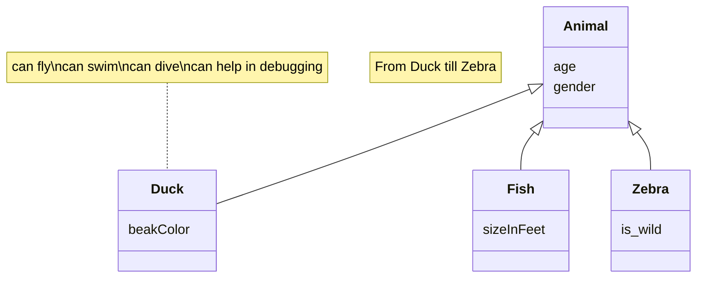

# Documento de diseño del sistema

## Introducción

Este proyecto pretende ofrecer la posibilidad de jugar de forma online al juego de mesa Skull King, juego de cartas con temática pirata en el cual deberás apostar el número exacto de bazas que crees que ganarás en cada ronda. El programa permite a la persona interesada crear un usuario con el que será capaz de contactar con otros jugadores e iniciar una partida. 

Esta adaptación tiene como límite 10 jugadores en partida. Además, no se podrá comenzar una partida a menos que haya 3 usuarios en esta.

### EXPLICACIÓN DEL JUEGO:

En el comienzo de la partida se realiza el primer reparto de cartas. El número de cartas vendrá determinado por la ronda en la que se encuentre la partida, por ejemplo: ronda 3, se reparten 3 cartas, una por cada baza. Existe una excepción en las partidas de más de 8 jugadores, pues en alguna ronda no se podrá aplicar la regla anterior ya que no hay suficientes cartas. Por ello, se repartirá el máximo de cartas posibles a cada jugador, siendo estas la misma cantidad.

Cada jugador jugará su carta, y siguiendo la jerarquía se determinará el ganador de cada baza. Una vez jugadas las bazas que forman la ronda, se realizará el cálculo de puntos, incluyendo los puntos de bonificación.

Finalmente, el ganador se definirá a partir de la suma de las puntuaciones de las 10 rondas que conforman la partida, la cual tiene una duración media de 30 minutos. 

### JERARQUÍA DE CARTAS:

En la cúspide de la jerarquía se encuentran las cartas de personaje: pirata, sirena y Skull King. Estos mantienen una relación parecida al juego “piedra, papel y tijera”; el pirata gana a la sirena, el Skull King al pirata y la sirena al Skull King. Además, debemos tener en cuenta la carta tigresa, pues puede ejercer dos papeles, pirata o bandera blanca. 

Siguiendo la jerarquía, hallamos el palo de triunfos con cartas numeradas del 1 al 14. Por debajo, se sitúan el resto de palos, morado, amarillo y verde, numerados de la misma forma. Finalmente, se encuentran las banderas blancas, las cuales pierden la baza independientemente del resto de cartas jugadas.

### CARTAS:

#### Bandera Blanca


 Las 5 cartas de bandera blanca pueden ser jugadas para ‘no ganar’ al considerarse de valor 0. Pierden con el resto de cartas. Son muy útiles para aseguraros no ganar más bazas de las que se han pujado.

#### Pirata


Las cartas de Pirata superan a todas las cartas numeradas. Todas son de igual valor, por lo que si se juegan más de una en la misma baza, quien haya jugado el primer pirata ganará la baza.

#### Tigresa


Al jugar la Tigresa, debéis declarar si contará como Pirata o como Huida. Asume todas la características de un pirata o de una huida.

#### Skull King


El Skull King vence a todas las cartas numeradas y todos los Piratas (incluida la Tigresa al ser jugada como Pirata). Las únicas que puede derrotarle son las Sirenas.

#### Sirena


Las Sirenas vencen a todos los palos numerados pero pierden con todos los Piratas,con la excepción del Skull King. Si se juegan ambas Sirenas en la misma baza, la primera que fue jugada ganará la baza.

#### Palos normales (amarillo, verde y morado)


Hay tres palos normales: amarillo (Cofre del Tesoro), verde (Loro) y morado (Mapa del Tesoro).

#### Palo Triunfo


Las cartas triunfo son superiores a la de las otras tres palos.

### PUNTUACIÓN:

A la hora de apostar se decide cómo se ganarán puntos. Por un lado, se puede apostar todo a perder, el jugador deberá perder todas las bazas. En el caso de acertar su apuesta se multiplicará por 10 el número de cartas de la ronda, y si se equivoca, se multiplicará por -10 el número anterior. Por otro lado, se puede realizar una apuesta normal en la cual las bazas ganadas se multiplicarán por 20 si se acierta la apuesta, en caso de que esta sea errónea, se multiplicará por -10 aquellas bazas no acertadas.

Una vez realizado dicho cálculo de puntos se sumarán los puntos de bonificación si y sólo si se ha acertado la apuesta. Para ello, se deberá analizar las bazas ganadas de cada jugador. 

Si se halla alguna carta 14 de los palos normales, se deberá sumar 10 puntos por cada una, y en el caso de encontrar el 14 del palo de triunfos, se sumarán 20 puntos. Para calcular los puntos que se obtienen con las cartas de personaje se deberá tener en cuenta las relaciones: 20 puntos por cada sirena ganada por el pirata, 30 puntos por cada pirata ganado por el Skull King, y 40 puntos si la sirena ha ganado al Skull King.

[Enlace al vídeo de explicación de las reglas del juego / partida jugada por el grupo](https://youtu.be/CV1VBWZAIJM)

## Diagrama(s) UML:

### Diagrama de Dominio/Diseño

_En esta sección debe proporcionar un diagrama UML de clases que describa el modelo de dominio, recuerda que debe estar basado en el diagrama conceptual del documento de análisis de requisitos del sistema pero que debe:_
•	_Especificar la direccionalidad de las relaciones (a no ser que sean bidireccionales)_
•	_Especificar la cardinalidad de las relaciones_
•	_Especificar el tipo de los atributos_
•	_Especificar las restricciones simples aplicadas a cada atributo de cada clase de domino_
•	_Incluir las clases específicas de la tecnología usada, como por ejemplo BaseEntity, NamedEntity, etc._
•	_Incluir los validadores específicos creados para las distintas clases de dominio (indicando en su caso una relación de uso con el estereotipo <<validates>>._

_Un ejemplo de diagrama para los ejercicios planteados en los boletines de laboratorio sería (hemos omitido las generalizaciones hacia BaseEntity para simplificar el diagrama):_


_Ej:_


_En este caso hemos vuelto a usar mermaid para crear el diagrama de dominio/diseño, pero recuerda que puedes usar cualquier otra herramienta que consideres oportuno para crear tus diagramas e inclurlos en este document como imagen tal y como se explica en [este tutorial](https://www.baeldung.com/ops/github-readme-insert-image)_

### Diagrama de Capas (incluyendo Controladores, Servicios y Repositorios)


En este diagrama de capas podemos ver las relaciones entre los controladores de cada entidad y los distintos servicios, además de las conexiones con los repositorios.

Las entidades implicadas son: Partida, Ronda, Baza, Mano, Truco, Carta, Jugador y Usuario.

## Descomposición del mockups del tablero de juego en componentes

En esta sección procesaremos el mockup del tablero de juego (o los mockups si el tablero cambia en las distintas fases del juego). Etiquetaremos las zonas de cada una de las pantallas para identificar componentes a implementar. Para cada mockup se especificará el árbol de jerarquía de componentes, así como, para cada componente el estado que necesita mantener, las llamadas a la API que debe realizar y los parámetros de configuración global que consideramos que necesita usar cada componente concreto. 
Por ejemplo, para la pantalla de visualización de métricas del usuario en un hipotético módulo de juego social:


  - App – Componente principal de la aplicación
    - $\color{orange}{\textsf{NavBar – Barra de navegación lateral}}$
      - $\color{darkred}{\textsf{[ NavButton ]. Muestra un botón de navegación con un icono asociado.}}$
    - $\color{darkblue}{\textsf{UserNotificationArea – Área de notificaciones e identificación del usuario actual}}$
    - $\color{blue}{\textsf{MetricsBar – En este componente se muestran las métricas principales del juego. Se mostrarán 4 métricas: partidas jugadas, puntos logrados, tiempo total, y cartas jugadas.}}$
      - $\color{darkgreen}{\textsf{[ MetricWell ] – Proporciona el valor y el incremento semanal de una métrica concreta. }}$
    - $\color{purple}{\textsf{GamesEvolutionChart – Muestra la tendencia de evolución en ellos últimos 4 meses en cuanto a partida jugadas, ganadas, perdidas y abandonadas.}}$
    - $\color{yellow}{\textsf{PopularCardsChart – Muestra la proporción de las N (parámetro de configuración) cartas más jugadas en el juego por el jugador.}}$
    - $\color{red}{\textsf{FrequentCoPlayersTable – Muestra los jugadores  con los que más se  ha jugado (de M en M donde M es un parámetro definido por la configuración del componente). Concretamente, se mostrarán la el nombre, la fecha de la última partida, la localización del jugador el porcentaje de partidas jugadas por ambos en las que el usuario ha ganado y si el jugador es amigo o no del usuario.}}$

## Documentación de las APIs
Se considerará parte del documento de diseño del sistema la documentación generada para las APIs, que debe incluir como mínimo, una descripción general de las distintas APIs/tags  proporcionadas. Una descripción de los distintos endpoints y operaciones soportadas. Y la especificación de las políticas de seguridad especificadas para cada endpoint y operación. Por ejemplo: “la operación POST sobre el endpoint /api/v1/game, debe realizarse por parte de un usuario autenticado como Player”.

Si lo desea puede aplicar la aproximación descrita en https://vmaks.github.io/2020/02/09/how-to-export-swagger-specification-as-html-or-word-document/ para generar una versión en formato Word de la especificación de la API generada por OpenAPI, colgarla en el propio repositorio y enlazarla en esta sección del documento.  En caso contrario debe asegurarse de que la interfaz de la documentación open-api de su aplicación está accesible, funciona correctamente, y está especificada conforme a las directrices descritas arriba.

## Patrones de diseño y arquitectónicos aplicados
En esta sección de especificar el conjunto de patrones de diseño y arquitectónicos aplicados durante el proyecto.

### Patrón: < Modelo Vista Controlador (MVC) >
*Tipo*: Arquitectónico

*Contexto de Aplicación*

Se utiliza en toda la aplicación, separa los datos de la aplicación, la interfaz de usuario y la lógica de negocio en 3 componentes.

Modelo: Representación específica de la información con la que se opera, incluye los datos y la lógica para operar con ellos. Dentro del modelo se incluyen: entidades, repositorios y servicios.

Controlador: Responde a eventos de la interfaz de usuario e invoca cambios en el modelo y probablemente en la vista (intermediario entre vista y modelo).

Vista: Presentación del modelo de forma adecuada para interactuar con ella, representando la información proporcionada por el controlador.

*Clases o paquetes creados*

Respecto a los paquetes, cada entidad tiene su paquete. En ellos se encuentra la entidad y sus respectivos repository, service y rest controller.

Respecto a las vistas, por el momento, se han creado los paquetes play, salaEspera y player. En ellos se encuentran, respectivamente, el manejo de creación y unión a partidas, la sala de espera donde se van uniendo los jugadores, y las instrucciones.

*Ventajas alcanzadas al aplicar el patrón*

Ofrece soporte para múltiples vistas, favorece la alta cohesión, el bajo acoplamiento y la separación de responsabilidades. Facilita el desarrollo y las pruebas de cada tipo de componente.

### Patrón: < Arquitectura centrada en datos >
*Tipo*: Diseño

*Contexto de Aplicación*

Se ha implementado una base de datos donde se encuentrán almacenadors datos de uusarios y todas las cartas del juego. Aquí también se puden almacenar datos de todas las entidades para probar las distintas excepciones de manera rápida.

*Clases o paquetes creados*

En el repositorio del proyecto inicialmente venía incluida una clase data.sql.

*Ventajas alcanzadas al aplicar el patrón*

La principal ventaja es la posibilidad de o¡introducir todas las cartas directamente en base de datos, evitando así tener que crearlas una a una cada vez que se inicia una partida.

### Patrón: < Dependency Injection >
*Tipo*: Diseño

*Contexto de Aplicación*

Se utiliza el patrón de Inyección de Dependencias para gestionar las dependencias entre componentes de manera flexible. Este patrón facilita la creación de sistemas modulares y mantenibles al desacoplar los objetos y permitir la configuración externa de sus dependencias.

*Clases o paquetes creados*

Las clases mencionadas en el patrón MVC. Normalmente los servicios son las clases que se inyectan en los controladores, y los repositorios se inyectan en los servicios.

*Ventajas alcanzadas al aplicar el patrón*

Nos aseguramos de que se cree solo una instancia de estas clases y que todas las clases que la necesiten puedan acceder a ella. Hacer esto sin un contenedor de inversión de control (Spring en este caso) resulta complicado. Permitimos que el framework realice operaciones complejas facilitando y ayudando mucho al programador en numerosas clases.

### Patrón: < Layer Super Type >
*Tipo*: Arquitectónico | de Diseño

*Contexto de Aplicación*

Este patrón se utiliza para compartir comportamientos comunes y atributos entre clases en una jerarquía, generalmente situados en la capa superior de dicha jerarquía. Nos ha sido esencial la utilidad de este patrón para la codificación de la aplicación ya que varios objetos java de nuestro modelo de dominio hacen uso de este concepto.

*Clases o paquetes creados*

Se ha usado la clase BaseEntity.java.

*Ventajas alcanzadas al aplicar el patrón*

El patrón Layer Super type ofrece beneficios en el diseño de software al facilitar la reutilización de código, promover la consistencia, mejorar la mantenibilidad y proporcionar claridad en la jerarquía de clases. Además, se evita la duplicación de código y se simplifica el mantenimiento al tener un único punto de modificación para elementos compartidos.

## Decisiones de diseño
_En esta sección describiremos las decisiones de diseño que se han tomado a lo largo del desarrollo de la aplicación que vayan más allá de la mera aplicación de patrones de diseño o arquitectónicos._

### Decisión X
#### Descripción del problema:*

Describir el problema de diseño que se detectó, o el porqué era necesario plantearse las posibilidades de diseño disponibles para implementar la funcionalidad asociada a esta decisión de diseño.

#### Alternativas de solución evaluadas:
Especificar las distintas alternativas que se evaluaron antes de seleccionar el diseño concreto implementado finalmente en el sistema. Si se considera oportuno se pude incluir las ventajas e inconvenientes de cada alternativa

#### Justificación de la solución adoptada

Describir porqué se escogió la solución adoptada. Si se considera oportuno puede hacerse en función de qué  ventajas/inconvenientes de cada una de las soluciones consideramos más importantes.
Os recordamos que la decisión sobre cómo implementar las distintas reglas de negocio, cómo informar de los errores en el frontend, y qué datos devolver u obtener a través de las APIs y cómo personalizar su representación en caso de que sea necesario son decisiones de diseño relevantes.

_Ejemplos de uso de la plantilla con otras decisiones de diseño:_

### Decisión 1: Importación de datos reales para demostración
#### Descripción del problema:

Como grupo nos gustaría poder hacer pruebas con un conjunto de datos reales suficientes, porque resulta más motivador. El problema es al incluir todos esos datos como parte del script de inicialización de la base de datos, el arranque del sistema para desarrollo y pruebas resulta muy tedioso.

#### Alternativas de solución evaluadas:

*Alternativa 1.a*: Incluir los datos en el propio script de inicialización de la BD (data.sql).

*Ventajas:*
•	Simple, no requiere nada más que escribir el SQL que genere los datos.
*Inconvenientes:*
•	Ralentiza todo el trabajo con el sistema para el desarrollo. 
•	Tenemos que buscar nosotros los datos reales

*Alternativa 1.b*: Crear un script con los datos adicionales a incluir (extra-data.sql) y un controlador que se encargue de leerlo y lanzar las consultas a petición cuando queramos tener más datos para mostrar.
*Ventajas:*
•	Podemos reutilizar parte de los datos que ya tenemos especificados en (data.sql).
•	No afecta al trabajo diario de desarrollo y pruebas de la aplicación
*Inconvenientes:*
•	Puede suponer saltarnos hasta cierto punto la división en capas si no creamos un servicio de carga de datos. 
•	Tenemos que buscar nosotros los datos reales adicionales

*Alternativa 1.c*: Crear un controlador que llame a un servicio de importación de datos, que a su vez invoca a un cliente REST de la API de datos oficiales de XXXX para traerse los datos, procesarlos y poder grabarlos desde el servicio de importación.

*Ventajas:*
•	No necesitamos inventarnos ni buscar nosotros lo datos.
•	Cumple 100% con la división en capas de la aplicación.
•	No afecta al trabajo diario de desarrollo y pruebas de la aplicación
*Inconvenientes:*
•	Supone mucho más trabajo. 
•	Añade cierta complejidad al proyecto

*Justificación de la solución adoptada*
Como consideramos que la división en capas es fundamental y no queremos renunciar a un trabajo ágil durante el desarrollo de la aplicación, seleccionamos la alternativa de diseño 1.c.

## Refactorizaciones aplicadas

Si ha hecho refactorizaciones en su código, puede documentarlas usando el siguiente formato:

### Refactorización X: 
En esta refactorización añadimos un mapa de parámtros a la partida para ayudar a personalizar la información precalculada de la que partimos en cada fase del juego.
#### Estado inicial del código
```Java 
class Animal
{
}
``` 
_Puedes añadir información sobre el lenguaje concreto en el que está escrito el código para habilitar el coloreado de sintaxis tal y como se especifica en [este tutorial](https://docs.github.com/es/get-started/writing-on-github/working-with-advanced-formatting/creating-and-highlighting-code-blocks)_

#### Estado del código refactorizado

```
código fuente en java, jsx o javascript
```
#### Problema que nos hizo realizar la refactorización
_Ej: Era difícil añadir información para implementar la lógica de negocio en cada una de las fases del juego (en nuestro caso varía bastante)_
#### Ventajas que presenta la nueva versión del código respecto de la versión original
_Ej: Ahora podemos añadir arbitrariamente los datos que nos hagan falta al contexto de la partida para que sea más sencillo llevar a cabo los turnos y jugadas_
